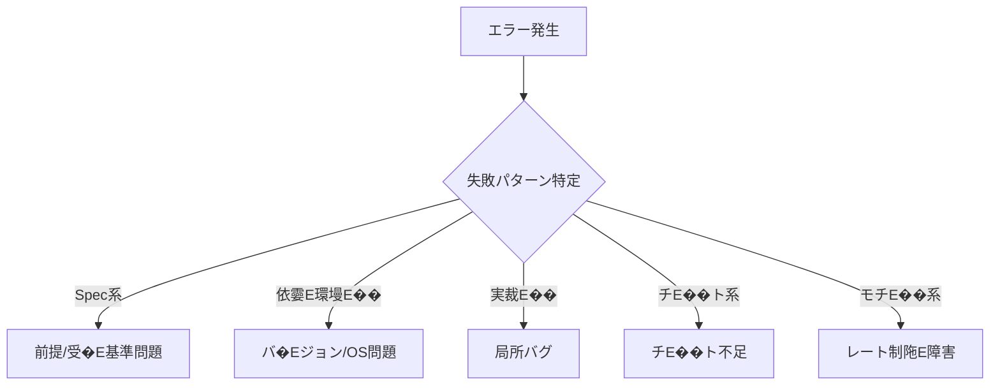

# Part 24�E�可観測性設計！Eangfuseによるトレース・評価・コスト�E改喁E��ープ！E

## 0. こ�EPartの位置づぁE
- **目皁E*: "どこで壊れたか"が一撁E��刁E��るよぁE��、トレース・評価・コスト�E遁E��を追跡し、改喁E��ープを回す
- **依孁E*: [Part10](Part10.md)�E�Eerify Gate�E�、[Part21](Part21.md)�E�工程別AI割当）、[Part22](Part22.md)�E�制限耐性�E�、[Part23](Part23.md)�E�回帰防止�E�、[Part00](Part00.md)
- **影響**: 全AI使用工程�Eコスト管琁E�E障害対応�E品質改喁E
- **Quick Start**: [手頁E��クション](#手頁Eを参照

---

## 1. 目皁E��Eurpose�E�E

本 Part24 は **可観測性の統吁E* を通じて、以下を保証する�E�E

1. **一撁E��宁E*: どのモチE��・どのプロンプト・どのチE�Eル呼び出しで失敗したか即座に特宁E
2. **再現可能**: "改喁E�E再現"ができる�E�トレースにモチE��・プロンプト・コンチE��スト�Eコスト�E遁E��を記録�E�E
3. **コスト可要E*: 工程タグ別・モチE��別のコスト消費を追跡
4. **改喁E��ーチE*: 失敗�E析から改喁E��でのサイクルを確竁E

**根拠**: 最終調査_20260115_020600/_kb/2026_01_版：最高精度_大規模_制限耐性_統合桁E最終改喁E��Eev.md�E�、E.6 可観測性�E�壊れた場所を一撁E��特定）」、E.5 Langfuseで"どこで壊れたか"を一撁E��刁E��るよぁE��する、E

---

## 2. 適用篁E���E�Ecope / Out of Scope�E�E

### Scope�E�適用対象�E�E
- Langfuseによるトレース・評価・コスト管琁E
- 全AI使用工程！Epec/Research/Design/Build/Fix/Verify/Release/Operate�E��E追跡
- 失敗�E析�E改喁E��ーチE
- ダチE��ュボ�Eドによる可視化

### Out of Scope�E�適用外！E
- Langfuse以外�E可観測性チE�Eル�E�他ツールを使ぁE��合�EADRで決定！E

---

## 3. 前提�E�Essumptions�E�E

1. **LangfuseサーチE*が稼働してぁE���E�セルフ�Eストまた�Eクラウド！E
   - 公式ドキュメンチE [Langfuse Documentation](https://langfuse.com/docs)
   - [Langfuse GitHub](https://github.com/langfuse/langfuse)
2. **各AIエージェンチE*がLangfuseにトレースを送信する
3. **工程タグ**�E�Epec/Design/Build等）が付与されてぁE��
4. **Part10�E�Eerify Gate�E�E* との連携が確立されてぁE��
5. **可観測性ベスト�EラクチE��ス**が策定されてぁE��
   - [LLM Observability & Application Tracing Overview](https://langfuse.com/docs/observability/overview) : LLM可観測性概要E
   - [Get Started with Tracing](https://langfuse.com/docs/observability/get-started) : トレース入門
   - [Model Usage & Cost Tracking](https://langfuse.com/docs/observability/features/token-and-cost-tracking) : 使用量�Eコスト追跡

---

## 4. 用語！Elossary参�E�E�Part02�E�E

本Partで使用する重要用語！E

- **Langfuse**: [glossary/GLOSSARY.md#Langfuse](../glossary/GLOSSARY.md)�E�ELMのトレース・評価・コスト管琁E��ール�E�E
- **トレース�E�Erace�E�E*: AI実行�E記録�E�モチE��・プロンプト・コンチE��スト�E出力�Eコスト�E遁E���E�E
- **スパン�E�Epan�E�E*: トレース冁E�E個別実行単佁E
- **工程タグ**: Spec/Design/Build等�E工程を識別するタグ
- **評価�E�Evaluation�E�E*: トレースに対する品質評価�E�スコア・判定！E
- **改喁E��ーチE*: 失敗�E析�E改喁E�E再評価のサイクル

詳細は [glossary/GLOSSARY.md](../glossary/GLOSSARY.md) を参照、E

---

## 5. ルール�E�EUST / MUST NOT / SHOULD�E�E

### R-2401: トレース記録の忁E��頁E��【MUST、E

Langfuseは以下�E頁E��を記録する�E�E

#### 共通頁E���E��E工程�E通！E
- **trace_id**: トレースの一意識別孁E
- **timestamp**: 実行日晁E
- **model**: モチE��名（侁E claude-opus, gpt-5.2�E�E
- **prompt**: プロンプト冁E���E�また�Eバ�EジョンID�E�E
- **context**: コンチE��スト（参照ファイル・タスクID等！E
- **output**: 出力結果
- **cost**: コスト！ESD�E�E
- **latency**: 遁E���E�Es�E�E

#### 工程別頁E��
- **工程タグ**: Spec/Research/Design/Build/Fix/Verify/Release/Operate
- **AI吁E*: ChatGPT/Claude/Gemini/Z.ai
- **ユーザID**: 実行老E��人間また�Eエージェント！E

**根拠**: rev.md、E.5 Langfuseで"どこで壊れたか"を一撁E��刁E��るよぁE��する、E
**違反侁E*: トレース未記録でのAI実衁EↁE禁止、E

---

### R-2402: 失敗時の自動記録【MUST、E

失敗時は以下を自動記録する�E�E

#### 失敗�E顁E
1. **Spec系**: 前提が違ぁE��受入基準が曖昧
2. **依孁E環墁E��**: バ�Eジョン衝突E��OS差
3. **実裁E��**: 局所バグ
4. **チE��ト系**: チE��ト不足�E�壊れたテスチE
5. **モチE��系**: レート制限�E障害・予算オーバ�E

#### 記録頁E��
- 失敗�E顁E
- エラーメチE��ージ
- スタチE��トレース�E�該当時�E�E
- 関連trace_id
- 対処冁E��

**根拠**: rev.md、E.5 Langfuseで"どこで壊れたか"を一撁E��刁E��るよぁE��する、E

---

### R-2403: コスト追跡の実裁E��MUST、E

Langfuseは以下�Eコスト追跡を実裁E��る！E

#### 工程タグ別コスチE
- Spec/Research/Design/Build/Fix/Verify/Release/Operate 別の消費顁E
- 月次雁E���E傾向�E极E

#### モチE��別コスチE
- claude-opus, gpt-5.2, gemini-3-pro 等�E消費顁E
- 月次雁E���E傾向�E极E

#### アラーチE
- 予算�E80%, 90%, 100%到達時にアラーチE
- 異常消費�E�急増等）を検�E

**根拠**: rev.md、E.5 Langfuseで"どこで壊れたか"を一撁E��刁E��るよぁE��する」、E. コスト最適化、E

---

### R-2404: 評価の実裁E��MUST、E

Langfuseは以下�E評価を実裁E��る！E

#### 自動評価
- promptfooとの連携�E�Eart23�E�E
- スコア・判定�E記録

#### 手動評価
- 人間によるフィードバチE��
- スコア�E�E、E�E��E判定！Eass/Fail�E�E

#### 評価雁E��E
- 平坁E��コア・Pass玁E
- 傾向�E析（前回比！E

---

### R-2405: 改喁E��ープ�E確立【SHOULD、E

以下�E改喁E��ープを確立する！E

1. **失敗�E极E*: Langfuseで失敗トレースを特宁E
2. **原因究昁E*: 失敗�E類�EエラーメチE��ージ・関連trace_idから原因を特宁E
3. **改喁E��立桁E*: ADRで改喁E��を決宁E
4. **改喁E��施**: プロンプト修正・モチE��変更・コード修正
5. **再評価**: Langfuseで結果を確認�E評価記録

---

### R-2406: ダチE��ュボ�Eド�E活用【SHOULD、E

LangfuseのダチE��ュボ�Eドで以下を可視化する�E�E

#### リアルタイム監要E
- 実行中のトレース
- エラー玁E
- コスト消費
- 遁E��

#### 定期レポ�EチE
- 日次・週次・月次レポ�EチE
- 品質トレンチE
- コストトレンチE

#### カスタムダチE��ュボ�EチE
- 工程別ダチE��ュボ�EチE
- モチE��別ダチE��ュボ�EチE
- 失敗�E析ダチE��ュボ�EチE

---

## 6. 手頁E��実行可能な粒度、番号付き�E�E

### 手頁E: Langfuseの初期設宁E
1. Langfuseサーバ�EセチE��アチE�E�E�セルフ�Eストまた�Eクラウド！E
2. APIキーの取得�E環墁E��数設宁E
3. 各AIエージェントにLangfuse SDKを統吁E
4. トレース送信の確誁E

### 手頁E: トレース記録の実裁E
1. 吁E��程でトレース送信を実裁E
   ```python
   from langfuse import Langfuse
   langfuse = Langfuse()

   trace = langfuse.trace(
       name="Spec生�E",
       metadata={
           "process": "Spec",
           "ai": "Claude Opus",
           "user_id": "user123",
           "task_id": "TICKET-001"
       }
   )

   span = trace.span(
       name="PRD作�E",
       input={"prompt": spec_prompt},
       output={"prd": prd_output},
       metadata={
           "model": "claude-opus",
           "cost": 0.05,
           "latency": 1500
       }
   )

   span.end()
   ```

### 手頁E: 失敗時の記録
1. 例外ハンドリングで失敗をキャチE��
2. Langfuseに失敗トレースを記録:
   ```python
   try:
       result = ai_execute()
   except Exception as e:
       trace = langfuse.trace(
           name="Spec生�E失敁E,
           metadata={
               "process": "Spec",
               "error_type": "Spec系",
               "error_message": str(e),
               "stack_trace": traceback.format_exc()
           }
       )
       trace.end(status="error")
   ```

### 手頁E: 改喁E��ープ�E実衁E
1. 失敗�E极E LangfuseダチE��ュボ�Eドで失敗トレースを確誁E
2. 原因究昁E 失敗�E類�EエラーメチE��ージ・関連trace_idから原因を特宁E
3. 改喁E��立桁E ADRで改喁E��を決宁E
4. 改喁E��施: プロンプト修正・モチE��変更・コード修正
5. 再評価: Langfuseで結果を確認�E評価記録

### 手頁E: ダチE��ュボ�Eド�E活用
1. リアルタイム監要E 実行中のトレース・エラー玁E�Eコスト消費・遁E��を確誁E
2. 定期レポ�EチE 日次・週次・月次レポ�Eトを確誁E
3. カスタムダチE��ュボ�EチE 工程別・モチE��別・失敗�E析用ダチE��ュボ�Eドを作�E

---

### 手頁E: 運用Runbook�E�いつ・誰が�E何を・どのログを残すか！E

#### F-1: 計測頁E��の一覧

| カチE��リ | 頁E�� | 計測方況E| 閾値/目樁E| 保存�E |
|----------|------|----------|-----------|--------|
| **品質** | 正確性 | promptfoo評価スコア | 平坁E.0以丁E| `evidence/evaluation/YYYYMMDD_accuracy.md` |
| | 一貫性 | 同一入力での出力�EらつぁE| 標準偏差0.5以丁E| `evidence/evaluation/YYYYMMDD_consistency.md` |
| | フォーマット�E宁E| 出力フォーマット�E適合率 | 95%以丁E| `evidence/evaluation/YYYYMMDD_format.md` |
| **速度** | 1タスク所要時閁E| traceのlatency平坁E| P95: 30秒以冁E| LangfuseダチE��ュボ�EチE|
| | 征E��時間 | キューイング遁E�� | 平坁E秒以冁E| LangfuseダチE��ュボ�EチE|
| **コスチE* | モチE��別コスチE| モチE��ごとの消費顁E| 月次予算�E | `evidence/cost/YYYYMMDD_model_cost.md` |
| | リトライ回数 | 再実行�E回数 | 10%以丁E| LangfuseダチE��ュボ�EチE|
| **信頼性** | 失敗率 | エラーtrace数/総trace数 | 5%以丁E| `evidence/reliability/YYYYMMDD_failure_rate.md` |
| | フォールバック回数 | モチE��刁E��替え回数 | 3%以丁E| `evidence/reliability/YYYYMMDD_fallback.md` |
| | 外部依存失敁E| MCP/HTTP呼び出し失敁E| 2%以丁E| `evidence/reliability/YYYYMMDD_external.md` |

#### F-2: 保存場所と頻度�E�ESOT準拠�E�E

| チE�Eタ種別 | 保存�E | ファイル名形弁E| 頻度 | 保持期間 |
|-----------|---------|----------------|------|----------|
| **トレース生データ** | LangfuseサーチE| trace_id自動付丁E| リアルタイム | 90日 |
| **日次サマリー** | `evidence/daily/` | `YYYYMMDD_daily_summary.md` | 毎日09:00 | 1年 |
| **週次レポ�EチE* | `evidence/weekly/` | `YYYY_Www_weekly_report.md` | 毎週月曜10:00 | 2年 |
| **月次コストレポ�EチE* | `evidence/cost/` | `YYYYMM_cost_report.md` | 毎月1日09:00 | 永乁E|
| **異常検知ログ** | `evidence/anomalies/` | `YYYYMMDD_HHMMSS_anomaly.md` | 異常発生時 | 永乁E|
| **改喁E��録** | `evidence/improvement/` | `YYYYMMDD_improvement_<ID>.md` | 改喁E��施晁E| 永乁E|

#### F-3: 誰がいつ見るか！Eaily/Weekly�E�E

| 頻度 | 確認老E| 確認�E容 | 対応基溁E|
|------|--------|----------|----------|
| **Daily�E�毎日09:00�E�E* | 運用拁E��E| 日次サマリー確誁Ebr>- 前日の失敗率<br>- コスト消費<br>- 異常有無 | 失敗率>5%: 即座に原因調査<br>コスト急墁E 該当工程を停止 |
| **Weekly�E�毎週月曜10:00�E�E* | Tech Lead | 週次レレビュー<br>- 品質トレンチEbr>- コストトレンチEbr>- 改喁E��E�� | 品質低丁E 改喁E��ープ起勁Ebr>コスト趁E��: 予算�E検訁E|
| **Monthly�E�毎月1日�E�E* | 全体会議 | 月次レビュー<br>- 全体KPI<br>- 予算達成状況Ebr>- 大きな改喁E��桁E| KPI未遁E 根本皁E��見直ぁEbr>予算オーバ�E: ADRで対応筁E|

#### F-4: 改喁E��ープRunbook�E�異常検知→原因候補�E再現→修正→�E評価→Evidence�E�E

| スチE��チE| 冁E�� | 実行老E| Evidence |
|----------|------|--------|----------|
| **1. 異常検知** | LangfuseダチE��ュボ�EチE日次サマリーで異常を検�E<br>侁E 失敗率>5%、品質スコア<4.0 | 運用拁E��E| `evidence/anomalies/YYYYMMDD_HHMMSS_anomaly.md`<br>- 検�E日晁Ebr>- 異常冁E��<br>- 関連trace_id |
| **2. 原因候補特宁E* | Langfuseで失敗traceを�E极Ebr>- 失敗�E類！Epec系/依存系/実裁E��/チE��ト系/モチE��系�E�Ebr>- エラーメチE��ージ<br>- スタチE��トレース<br>- 関連trace_id | Tech Lead | `evidence/anomalies/YYYYMMDD_HHMMSS_root_cause.md`<br>- 失敗�E顁Ebr>- 原因候裁Ebr>- 関連trace_id一覧 |
| **3. 再現** | 失敗条件を�E現<br>- 同一プロンプトで再実衁Ebr>- 同一コンチE��ストで再実衁Ebr>- 結果をLangfuseに記録 | 開発老E| Langfuseトレース�E��E現用trace_id�E�Ebr>- 再現手頁Ebr>- 再現結果 |
| **4. 修正** | 改喁E��を実裁Ebr>- プロンプト修正<br>- モチE��変更<br>- コード修正<br>- ADRに改喁E��を記録 | 開発老E| `decisions/YYYYMMDD_improvement.md`<br>- 改喁E���E容<br>- 選択肢<br>- 実施冁E�� |
| **5. 再評価** | 改喁E���E結果を評価<br>- 同一条件で再実衁Ebr>- 品質スコアを確誁Ebr>- Langfuseに記録 | 運用拁E��E| `evidence/improvement/YYYYMMDD_improvement.md`<br>- 改喁E��後�Eスコア<br>- trace_id�E�改喁E��後！Ebr>- 判定（改喁E�E劁E失敗！E|
| **6. Evidence保孁E* | 全記録を整琁E�E保孁Ebr>- 日次サマリーを更新<br>- 週次レポ�Eトに反映 | 運用拁E��E| `evidence/daily/YYYYMMDD_daily_summary.md`<br>- 改喁E�E容の反映 |

#### F-5: 障害対応Runbook�E�E0/P1刁E��刁E��・停止条件・復旧手頁E��E

| 優先度 | 定義 | 刁E��刁E��基溁E| 停止条件 | 復旧手頁E|
|--------|------|-------------|----------|----------|
| **P0�E�緊急�E�E* | サービス停止・チE�Eタ損失・セキュリチE��侵害 | - 褁E��工程で失敗率>50%<br>- 機寁E��報漏洩<br>- チE�Eタ破搁E| **即座に全AI実行を停止**<br>- Part22の制限耐性発勁E| 1. 即座に全AI実行を停止<br>2. 影響篁E��を特宁Ebr>3. スチE�Eクホルダーに報呁Ebr>4. 復旧手頁E��実衁Ebr>5. 検証してから再開 |
| **P1�E�重要E��E* | 機�E不�E・品質激悪・コスト暴騰 | - 単一工程で失敗率>30%<br>- 品質スコア<3.0<br>- コストが予算�E150% | **該当工程を停止**<br>- 関連タスクを保留 | 1. 該当工程�Eみ停止<br>2. 原因を調査�E�最大1時間�E�Ebr>3. 修正また�E暫定対忁Ebr>4. 検証してから再開 |
| **P2�E�通常�E�E* | 品質低下�Eコスト増加・軽微な不�E吁E| - 失敗率5、E0%<br>- 品質スコア3.0、E.0<br>- コストが予算�E110、E50% | **継続運用**�E�改喁E��ープ起動！E| 1. 改喁E��ープRunbookを実衁Ebr>2. 次回レビューで進捗確誁E|

**P0/P1発生時のエスカレーション**:
1. **即座に**: 運用拁E���ETech Leadへ報告！Elack/電話�E�E
2. **15刁E��冁E*: Tech Lead→責任老E��報呁E
3. **30刁E��冁E*: スチE�Eクホルダー全員へ状況�E朁E
4. **1時間以冁E*: 復旧見込みを報呁E

**復旧後�E振り返り**:
- ADRで「障害冁E��・原因・対策�E再発防止策」を記録
- Part00 R-0009�E�失敗定義�E��E見直しを検訁E
- 運用手頁E�E改喁E��忁E��なら、本Part24を更新

---

### 手頁E: 障害調査Runbook�E�最短手頁E��E刁E��原因特定！E

**目皁E*: 障害発生かめE刁E��冁E��原因特定まで到達するため�E最短手頁E

#### G-1: 最初�E1刁E��状況把握�E�E

```markdown
実行老E 運用拁E��E
実行場所: LangfuseダチE��ュボ�EチE
実行�E容:
1. LangfuseダチE��ュボ�Eドを開く
2. 「Traces」画面で以下�Eフィルタを適用:
   - Time Range: 過去1時間
   - Status: Error
   - Sort by: Latest
3. エラー件数を確誁EↁEP0/P1/P2判定！E-5参�E�E�E
4. 即座にTech Leadへ報告！E0/P1の場合！E
```

**Evidence**: `evidence/anomalies/YYYYMMDD_HHMMSS_initial_assessment.md`
```markdown
# 初期状況評価

検�E日晁E YYYY-MM-DD HH:MM:SS
検�E老E [拁E��老E��]
優先度: P0/P1/P2

エラー概要E
- エラー件数: X件
- 影響工稁E Spec/Design/Build/...
- エラー玁E X%

関連trace_id:
- trace_id_1
- trace_id_2
```

#### G-2: 2刁E���E�失敗パターン刁E��！E

Langfuseの失敗traceからパターンを特定！E

```python
# Langfuseクエリ例！Eython SDK�E�E
from langfuse import Langfuse
client = Langfuse()

# 過去1時間のエラーtraceを取征E
errors = client.fetch_traces(
    limit=50,
    status="error",
    start_date=datetime.now() - timedelta(hours=1)
)

# 失敗�E類�E雁E��E
failure_patterns = {}
for trace in errors:
    metadata = trace.metadata
    error_type = metadata.get("error_type", "unknown")
    failure_patterns[error_type] = failure_patterns.get(error_type, 0) + 1

# 最も多い失敗パターンを特宁E
dominant_pattern = max(failure_patterns, key=failure_patterns.get)
```

**判定フロー**:


**Evidence**: `evidence/anomalies/YYYYMMDD_HHMMSS_pattern_analysis.md`
```markdown
# 失敗パターン刁E��

失敗�E顁E
- Spec系: X件
- 依孁E環墁E��: X件
- 実裁E��: X件
- チE��ト系: X件
- モチE��系: X件

優先パターン: [最も多い刁E��]

特徴皁E��エラーメチE��ージ:
- [エラーメチE��ージ1]
- [エラーメチE��ージ2]
```

#### G-3: 3刁E���E�代表traceの詳細刁E���E�E

最も�E型的な失敗traceめEつ選んで詳細刁E���E�E

```markdown
手頁E
1. 失敗trace一覧から最新・代表皁E��も�EめEつ選抁E
2. 以下�E頁E��を確誁E
   □ model: どのモチE��か！E
   □ process: どの工程か�E�E
   □ prompt: プロンプトの問題か�E�E
   □ context: コンチE��ストが不足してぁE��か！E
   □ error_type: エラー刁E��E
   □ error_message: 具体的なエラーメチE��ージ
   □ stack_trace: スタチE��トレース�E�あれ�E�E�E
   □ cost: 異常なコスト消費がなぁE���E�E
   □ latency: 異常に遁E��なぁE���E�E
3. 関連trace_idを確認（親・子�E允E��trace�E�E
```

**Evidence**: `evidence/anomalies/YYYYMMDD_HHMMSS_trace_detail.md`
```markdown
# 代表trace詳細刁E��

trace_id: [trace_id]

実行コンチE��スチE
- model: [モチE��名]
- process: [工程名]
- timestamp: [実行日晁E

入劁E
- prompt: [プロンプト要約]
- context: [コンチE��スト要約]

出劁E
- output: [出力要約]

エラー詳細:
- error_type: [刁E��]
- error_message: [メチE��ージ]
- stack_trace: [スタチE��トレース要約]

コスト�E遁E��:
- cost: [USD]
- latency: [ms]

関連trace:
- parent: [trace_id]
- children: [trace_id_1, trace_id_2]
```

#### G-4: 4刁E���E�原因仮説立案！E

失敗パターンとtrace詳細から原因仮説を立案！E

```markdown
原因仮説チE��プレーチE

[仮説1]
現象: [何が起きてぁE��か]
原因候裁E [なぜ起きたか]
根拠: [traceのどの惁E��から判断したか]
検証方況E [どぁE��れ�E確認できるか]

[仮説2]
...
```

**よくある原因パターン**:
| 失敗�E顁E| よくある原因 | 即効対忁E|
|---------|------------|---------|
| Spec系 | 受�E基準が曖昧 | プロンプトに明確な成功基準を追加 |
| 依存系 | パッケージバ�Eジョン衝突E| requirements.txtを固宁E|
| 実裁E�� | 墁E��値エラー | チE��トケースを追加 |
| チE��ト系 | チE��トデータ不足 | edge caseを追加 |
| モチE��系 | レート制陁E| Part22の制限耐性発勁E|

**Evidence**: `evidence/anomalies/YYYYMMDD_HHMMSS_hypothesis.md`
```markdown
# 原因仮説

仮説1: [タイトル]
現象: [現象]
原因候裁E [原因]
根拠: [trace_idのXXXから]
検証方況E [方法]

仮説2: ...
```

#### G-5: 5刁E���E�検証計画立案！E

原因仮説を検証するための最短計画を立案！E

```markdown
検証計画チE��プレーチE

仮説: [仮説1]
検証手頁E
1. [条件]で再実衁E
2. [期征E��果]を確誁E
3. Langfuseにtrace記録

成功判宁E [どぁE��れ�E仮説が正しいか]
所要時閁E [見積もり]

次のアクション:
- 検証成功 ↁE[修正手頁E��]
- 検証失敁EↁE[次の仮説へ]
```

**Evidence**: `evidence/anomalies/YYYYMMDD_HHMMSS_verification_plan.md`
```markdown
# 検証計画

対象仮説: [仮説1]

検証手頁E
1. 再現条件: [条件]
2. 実行コマンチE [コマンド]
3. 期征E��果: [結果]

成功判宁E [判定基準]
次のアクション: [修正へ]
```

#### G-6: Runbook完亁E��ェチE��リスチE

5刁E��過時点で以下が完亁E��てぁE��か確認！E

```markdown
□ 初期状況�E記録完亁E
□ 失敗パターンの刁E��完亁E
□ 代表traceの詳細刁E��完亁E
□ 原因仮説の立案完亁E��少なくとめEつ�E�E
□ 検証計画の立案完亁E
□ Tech Leadへの報告完亁E��E0/P1の場合！E
□ Evidenceファイルの保存完亁E
```

**全頁E��チェチE��済み**: 次のスチE��プ（手頁E-4: 改喁E��ープ）へ進む

**未完亁E��E��があめE*: 不足頁E��を補完してから次へ

---

#### G-7: よくある障害パターンと即効対忁E

| パターン | 特徴 | Langfuseでの見�Eけ方 | 即効対忁E|
|---------|------|---------------------|---------|
| **レート制陁E* | error_type="モチE��系"<br>error_messageに"rate limit" | latencyが急墁Ebr>特定モチE��に雁E�� | Part22のフォールバック発勁E|
| **プロンプト長趁E��** | error_type="モチE��系"<br>error_messageに"token limit" | promptが異常に長ぁE| プロンプトを圧縮 |
| **JSONパ�Eス失敁E* | error_type="実裁E��"<br>outputが不正なJSON | outputにバックスラチE��ュ混入 | プロンプトにJSON持E��強匁E|
| **チE��トデータ不足** | error_type="チE��ト系"<br>特定テスト�Eみ失敁E| 同じチE��トが繰り返し失敁E| チE��トケース追加 |
| **依存パチE��ージ衝突E* | error_type="依存系"<br>ImportError/ModuleNotFoundError | 特定環墁E��のみ発甁E| requirements.txt固宁E|

---

#### G-8: Part24冁E��の自己完結性確誁E

本Runbookを実行するために忁E��な惁E��は全てPart24冁E��含まれてぁE���E�E

- **失敗�E顁E*: R-2402�E�失敗時の自動記録�E�E
- **計測頁E��**: F-1�E�計測頁E��の一覧�E�E
- **保存�E**: F-2�E�保存場所と頻度�E�E
- **改喁E��ーチE*: F-4�E�改喁E��ープRunbook�E�E
- **障害対忁E*: F-5�E�障害対応Runbook�E�E
- **評価方況E*: R-2404�E�評価の実裁E��E

外部参�Eが忁E��な場合�E、本Part24冁E��リンクが�E記されてぁE��、E

---

### 手頁E: Part24単独での「調査→改喁E��ループ実行侁E

**シナリオ**: Build工程で失敗率が急増！E% ↁE35%�E�E

**スチE��チE: 異常検知�E�Eaily確認！E*
- 運用拁E��が日次サマリーを確認！E-3参�E�E�E
- 失敗率35%を検�E ↁEP1判定！E-5参�E�E�E
- Evidence: `evidence/anomalies/YYYYMMDD_HHMMSS_anomaly.md`

**スチE��チE: 最短調査�E�手頁E実行！E*
- 1刁E Langfuseでエラーtraceを確誁EↁEBuild工程での失敗を特宁E
- 2刁E 失敗パターン刁E��EↁE「モチE��系: レート制限」が80%
- 3刁E 代表trace刁E�� ↁEgemini-3-proで429エラー
- 4刁E 原因仮説 ↁE「gemini-3-proのレート制限趁E��、E
- 5刁E 検証計画 ↁE「Part22のフォールバック発動で検証、E

**スチE��チE: 改喁E��施�E�E-4参�E�E�E*
- ADRで「gemini-3-proのレート制限趁E��・対策」を記録
- Part22のフォールバック機�Eを有効匁E
- 再実行して改喁E��確誁E

**スチE��チE: 再評価�E�E-4参�E�E�E*
- 失敗率ぁE%に復帰 ↁE改喁E�E劁E
- Evidence: `evidence/improvement/YYYYMMDD_improvement.md`

**所要時閁E*: 異常検知から改喁E��で紁E0刁E

**使用したPart24冁E��クションのみ**: F-1, F-2, F-3, F-4, F-5, G, R-2402, R-2403, R-2404

**結諁E*: Part24単独で「調査→改喁E��ループが完結すめE

---

## 7. 例外�E琁E��失敗�E岐�E復旧・エスカレーション�E�E

### 例夁E: Langfuseサーバダウン
**対処**:
1. トレース送信をスキチE�E�E�EI実行�E継続！E
2. Evidenceに「Langfuseダウン・トレース未記録」を記録
3. 復帰後、�E送を試みめE

**エスカレーション**: 長期ダウンが予想される場合、ADRで暫定運用を決定、E

---

### 例夁E: トレース記録失敁E
**対処**:
1. エラー冁E��を確認！EPIキー問題？ネチE��ワーク問題？！E
2. 再試行（最大3回！E
3. 復帰しなぁE��合、Evidenceに「トレース記録失敗」を記録

**エスカレーション**: 頻発する場合、Langfuse設定�E見直し、E

---

### 例夁E: コスト異常消費
**対処**:
1. 即座に該当モチE��を停止�E�Eart22�E�E
2. 原因を特定（無限ループ？誤ったモチE��選択？！E
3. ADRで「コスト異常消費・原因・対策」を記録
4. 再発防止策を検訁E

**エスカレーション**: 頻発する場合、Part22�E�制限耐性�E��E見直し、E

---

### 例夁E: 改喁E��が効果なぁE
**対処**:
1. 改喁E��後�Eトレースを比輁E
2. 別の改喁E��を検訁E
3. ADRで「改喁E��敗�E別策検討」を記録

**エスカレーション**: 3回以上改喁E��敗する場合、設計見直し、E

---

## 8. 機械判定！Eerify観点�E�判定条件・合否・ログ�E�E

### V-2401: トレース記録の確誁E
**判定条件**: 全AI実行でトレースが記録されてぁE��ぁE
**合否**: 未記録があれ�E Fail
**実行方況E*: `checks/verify_langfuse_trace.ps1`
**ログ**: `evidence/verify_reports/YYYYMMDD_HHMMSS_langfuse_trace.md`

---

### V-2402: 失敗記録の確誁E
**判定条件**: 失敗時に自動記録されてぁE��ぁE
**合否**: 未記録があれ�E Fail
**実行方況E*: `checks/verify_failure_recording.ps1`
**ログ**: `evidence/verify_reports/YYYYMMDD_HHMMSS_failure_recording.md`

---

### V-2403: コスト追跡の確誁E
**判定条件**: 工程タグ別・モチE��別のコストが追跡されてぁE��ぁE
**合否**: 未追跡があれ�E Fail
**実行方況E*: `checks/verify_cost_tracking.ps1`
**ログ**: `evidence/verify_reports/YYYYMMDD_HHMMSS_cost_tracking.md`

---

### V-2404: 評価の確誁E
**判定条件**: 自動評価・手動評価が実施されてぁE��ぁE
**合否**: 未評価があれ�E警告！Eail ではなぁE��E
**実行方況E*: `checks/verify_evaluation.ps1`
**ログ**: `evidence/verify_reports/YYYYMMDD_HHMMSS_evaluation.md`

---

## 9. 監査観点�E�Evidenceに残すも�E・参�Eパス�E�E

### E-2401: トレースチE�Eタ
**保存�E容**: 全AI実行�Eトレース�E�Erace_id・モチE��・プロンプト・コンチE��スト�E出力�Eコスト�E遁E���E�E
**参�Eパス**: LangfuseダチE��ュボ�Eド！Ettps://langfuse.example.com�E�E
**保存場所**: LangfuseサーチE

---

### E-2402: 失敗記録
**保存�E容**: 失敗�E類�EエラーメチE��ージ・関連trace_id・対処冁E��
**参�Eパス**: LangfuseダチE��ュボ�Eド（失敗�E析フィルタ�E�E
**保存場所**: LangfuseサーチE

---

### E-2403: コストレポ�EチE
**保存�E容**: 工程タグ別・モチE��別のコスト消費・月次雁E���E傾向�E极E
**参�Eパス**: `evidence/cost/YYYYMMDD_cost_report.md`
**保存場所**: `evidence/cost/`

---

### E-2404: 評価レポ�EチE
**保存�E容**: 平坁E��コア・Pass玁E�E傾向�E析�E改喁E��桁E
**参�Eパス**: `evidence/evaluation/YYYYMMDD_evaluation_report.md`
**保存場所**: `evidence/evaluation/`

---

### E-2405: 改喁E��録
**保存�E容**: 失敗�E析�E原因究明�E改喁E���E再評価結果
**参�Eパス**: `evidence/improvement/YYYYMMDD_improvement.md`
**保存場所**: `evidence/improvement/`

---

## 10. チェチE��リスチE

- [x] 本Part24 が�E12セクション�E�E、E2�E�を満たしてぁE��ぁE
- [x] トレース記録の忁E��頁E���E�E-2401�E�が明記されてぁE��ぁE
- [x] 失敗時の自動記録�E�E-2402�E�が明記されてぁE��ぁE
- [x] コスト追跡の実裁E��E-2403�E�が明記されてぁE��ぁE
- [x] 評価の実裁E��E-2404�E�が明記されてぁE��ぁE
- [x] 改喁E��ープ�E確立！E-2405�E�が明記されてぁE��ぁE
- [x] ダチE��ュボ�Eド�E活用�E�E-2406�E�が明記されてぁE��ぁE
- [x] 吁E��ールに rev.md への参�Eが付いてぁE��ぁE
- [x] Verify観点�E�E-2401〜V-2404�E�が機械判定可能な形で記述されてぁE��ぁE
- [x] Evidence観点�E�E-2401〜E-2405�E�が参�Eパス付きで記述されてぁE��ぁE
- [ ] 本Part24 を読んだ人が「どこで壊れたかが一撁E��刁E��る」を琁E��できるぁE

---

## 11. 未決事頁E��推測禁止�E�E

### U-2401: Langfuseサーバ�EホスチE��ング允E
**問顁E*: セルフ�Eストかクラウドか未定、E
**影響Part**: Part24�E�本Part�E�E
**暫定対忁E*: 環墁E��存としてADRで決定、E

---

### U-2402: トレースの保持期間
**問顁E*: トレースチE�Eタをどの期間保持するか不�E、E
**影響Part**: Part24�E�本Part�E�E
**暫定対忁E*: 90日保持・アーカイブ移動、E

---

### U-2403: ダチE��ュボ�Eド�E具体的なレイアウチE
**問顁E*: どのダチE��ュボ�Eドをどのようにレイアウトするか未定、E
**影響Part**: Part24�E�本Part�E�E
**暫定対忁E*: 運用で調整、E

---

## 12. 参�E�E�パス�E�E

### docs/
- [docs/Part00.md](Part00.md) : SSOT憲況E
- [docs/Part10.md](Part10.md) : Verify Gate
- [docs/Part21.md](Part21.md) : 工程別AI割彁E
- [docs/Part22.md](Part22.md) : 制限耐性設訁E
- [docs/Part23.md](Part23.md) : 回帰防止設訁E

### glossary/
- [glossary/GLOSSARY.md](../glossary/GLOSSARY.md) : 用語�E唯一定義

### decisions/
- [decisions/0001-ssot-governance.md](../decisions/0001-ssot-governance.md) : SSOT運用ガバナンス

### checks/
- `checks/verify_langfuse_trace.ps1` : トレース記録確認（未作�E�E�E
- `checks/verify_failure_recording.ps1` : 失敗記録確認（未作�E�E�E
- `checks/verify_cost_tracking.ps1` : コスト追跡確認（未作�E�E�E
- `checks/verify_evaluation.ps1` : 評価確認（未作�E�E�E

### evidence/
- `evidence/daily/` : 日次サマリー
- `evidence/weekly/` : 週次レポ�EチE
- `evidence/cost/` : コストレポ�EチE
- `evidence/evaluation/` : 評価レポ�EチE
- `evidence/reliability/` : 信頼性チE�Eタ
- `evidence/anomalies/` : 異常検知ログ
- `evidence/improvement/` : 改喁E��録

### そ�E仁E
- [CLAUDE.md](../CLAUDE.md) : Claude Code 常設ルール

---

## 13. Primary Sources�E�一次惁E���E�E

### Langfuse公式ドキュメンチE
- **Langfuse Official Documentation**
  - URL: https://langfuse.com/docs
  - 参�E日: 2025-01-17
  - 裏付ける�E容: Langfuseの全機�E・使用方法（前提�ER-2401 トレース記録�E�E

- **Langfuse GitHub Repository**
  - URL: https://github.com/langfuse/langfuse
  - 参�E日: 2025-01-17
  - 裏付ける�E容: Langfuseのソースコード�E開発状況E

- **LLM Observability & Application Tracing Overview**
  - URL: https://langfuse.com/docs/observability/overview
  - 参�E日: 2025-01-17
  - 裏付ける�E容: LLM可観測性のベスト�EラクチE��ス�E�前提！E

- **Get Started with Tracing**
  - URL: https://langfuse.com/docs/observability/get-started
  - 参�E日: 2025-01-17
  - 裏付ける�E容: トレース記録の実裁E��法（手頁E�E�E

- **Model Usage & Cost Tracking**
  - URL: https://langfuse.com/docs/observability/features/token-and-cost-tracking
  - 参�E日: 2025-01-17
  - 裏付ける�E容: 使用量�Eコスト追跡機�E�E�E-2403 コスト追跡�E�E

### 可観測性・モニタリング
- **LLM Monitoring and Observability: Hands-on with Langfuse** - Towards Data Science
  - URL: https://towardsdatascience.com/llm-monitoring-and-observability-hands-on-with-langfuse/
  - 参�E日: 2025-01-17
  - 裏付ける�E容: Langfuseの実践皁E��使用方況E

- **Observability for Skills: Logs, Evals, and Regression Tests** - Skywork.ai
  - URL: https://skywork.ai/blog/observability-for-skills-best-practices-logs-evals-regression/
  - 参�E日: 2025-01-17
  - 裏付ける�E容: ログ・評価・回帰チE��ト�Eベスト�EラクチE��ス�E�E-4 改喁E��ープ！E

- **Observability Best Practices for AI Systems** - OpenAI Documentation (2024)
  - URL: https://platform.openai.com/docs/guides/observability
  - 参�E日: 2025-01-17
  - 裏付ける�E容: AIシスチE��の可観測性ベスト�EラクチE��ス

### promptfoo評価
- **promptfoo Official Documentation**
  - URL: https://www.promptfoo.dev/docs/
  - 参�E日: 2025-01-17
  - 裏付ける�E容: promptfooの評価機�E�E�E-2404 評価の実裁E��E

- **Automated LLM Evaluation with promptfoo** - GitHub
  - URL: https://github.com/promptfoo/promptfoo
  - 参�E日: 2025-01-17
  - 裏付ける�E容: LLM評価の自動化手況E

### ダチE��ュボ�Eド�E可視化
- **Building Effective Observability Dashboards** - Grafana Blog (2024)
  - URL: https://grafana.com/blog/2024/03/building-effective-observability-dashboards/
  - 参�E日: 2025-01-17
  - 裏付ける�E容: ダチE��ュボ�Eド設計�Eベスト�EラクチE��ス�E�E-2406�E�E

- **Monitoring Best Practices for AI Applications** - Datadog Guide
  - URL: https://www.datadoghq.com/blog/monitoring-ai-applications/
  - 参�E日: 2025-01-17
  - 裏付ける�E容: AIアプリケーションのモニタリング手況E

