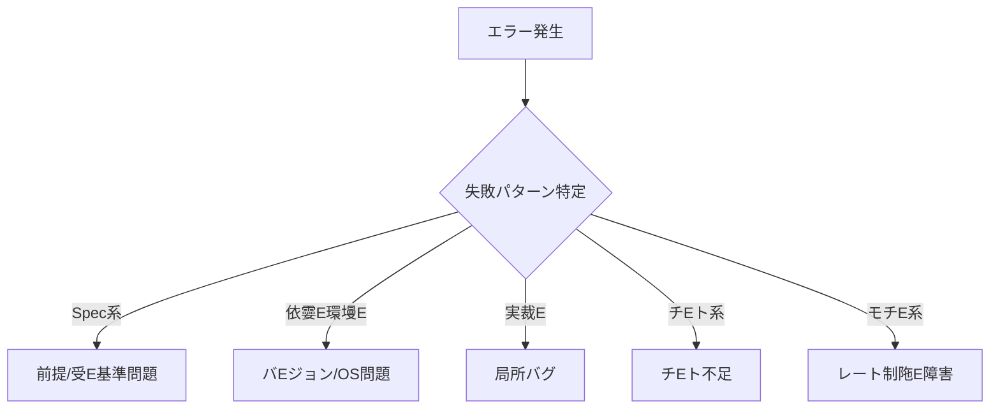

# Part 24E可観測性設計！Eangfuseによるトレース・評価・コストE改喁Eープ！E

## 0. こEPartの位置づぁE
- **目皁E*: "どこで壊れたか"が一撁E刁EるよぁE、トレース・評価・コストE遁Eを追跡し、改喁Eープを回す
- **依孁E*: [Part10](Part10.md)EEerify GateE、[Part21](Part21.md)E工程別AI割当）、[Part22](Part22.md)E制限耐性E、[Part23](Part23.md)E回帰防止E、[Part00](Part00.md)
- **影響**: 全AI使用工程Eコスト管琁EE障害対応E品質改喁E
- **Quick Start**: [手頁Eクション](#手頁Eを参照

---

## 1. 目皁EEurposeEE

本 Part24 は **可観測性の統吁E* を通じて、以下を保証するEE

1. **一撁E宁E*: どのモチE・どのプロンプト・どのチEEル呼び出しで失敗したか即座に特宁E
2. **再現可能**: "改喁EE再現"ができるEトレースにモチE・プロンプト・コンチEストEコストE遁Eを記録EE
3. **コスト可要E*: 工程タグ別・モチE別のコスト消費を追跡
4. **改喁EーチE*: 失敗E析から改喁Eでのサイクルを確竁E

**根拠**: 最終調査_20260115_020600/_kb/2026_01_版：最高精度_大規模_制限耐性_統合桁E最終改喁EEev.mdE、E.6 可観測性E壊れた場所を一撁E特定）」、E.5 Langfuseで"どこで壊れたか"を一撁E刁EるよぁEする、E

---

## 2. 適用篁EEEcope / Out of ScopeEE

### ScopeE適用対象EE
- Langfuseによるトレース・評価・コスト管琁E
- 全AI使用工程！Epec/Research/Design/Build/Fix/Verify/Release/OperateEE追跡
- 失敗E析E改喁EーチE
- ダチEュボEドによる可視化

### Out of ScopeE適用外！E
- Langfuse以外E可観測性チEEルE他ツールを使ぁE合EADRで決定！E

---

## 3. 前提EEssumptionsEE

1. **LangfuseサーチE*が稼働してぁEEセルフEストまたEクラウド！E
   - 公式ドキュメンチE [Langfuse Documentation](https://langfuse.com/docs)
   - [Langfuse GitHub](https://github.com/langfuse/langfuse)
2. **各AIエージェンチE*がLangfuseにトレースを送信する
3. **工程タグ**EEpec/Design/Build等）が付与されてぁE
4. **Part10EEerify GateEE* との連携が確立されてぁE
5. **可観測性ベストEラクチEス**が策定されてぁE
   - [LLM Observability & Application Tracing Overview](https://langfuse.com/docs/observability/overview) : LLM可観測性概要E
   - [Get Started with Tracing](https://langfuse.com/docs/observability/get-started) : トレース入門
   - [Model Usage & Cost Tracking](https://langfuse.com/docs/observability/features/token-and-cost-tracking) : 使用量Eコスト追跡

---

## 4. 用語！Elossary参EEPart02EE

本Partで使用する重要用語！E

- **Langfuse**: [glossary/GLOSSARY.md#Langfuse](../glossary/GLOSSARY.md)EELMのトレース・評価・コスト管琁EールEE
- **トレースEEraceEE*: AI実行E記録EモチE・プロンプト・コンチEストE出力EコストE遁EEE
- **スパンEEpanEE*: トレース冁EE個別実行単佁E
- **工程タグ**: Spec/Design/Build等E工程を識別するタグ
- **評価EEvaluationEE*: トレースに対する品質評価Eスコア・判定！E
- **改喁EーチE*: 失敗E析E改喁EE再評価のサイクル

詳細は [glossary/GLOSSARY.md](../glossary/GLOSSARY.md) を参照、E

---

## 5. ルールEEUST / MUST NOT / SHOULDEE

### R-2401: トレース記録の忁E頁E【MUST、E

Langfuseは以下E頁Eを記録するEE

#### 共通頁EEE工程E通！E
- **trace_id**: トレースの一意識別孁E
- **timestamp**: 実行日晁E
- **model**: モチE名（侁E claude-opus, gpt-5.2EE
- **prompt**: プロンプト冁EEまたEバEジョンIDEE
- **context**: コンチEスト（参照ファイル・タスクID等！E
- **output**: 出力結果
- **cost**: コスト！ESDEE
- **latency**: 遁EEEsEE

#### 工程別頁E
- **工程タグ**: Spec/Research/Design/Build/Fix/Verify/Release/Operate
- **AI吁E*: ChatGPT/Claude/Gemini/Z.ai
- **ユーザID**: 実行老E人間またEエージェント！E

**根拠**: rev.md、E.5 Langfuseで"どこで壊れたか"を一撁E刁EるよぁEする、E
**違反侁E*: トレース未記録でのAI実衁EↁE禁止、E

---

### R-2402: 失敗時の自動記録【MUST、E

失敗時は以下を自動記録するEE

#### 失敗E顁E
1. **Spec系**: 前提が違ぁE受入基準が曖昧
2. **依孁E環墁E**: バEジョン衝突EOS差
3. **実裁E**: 局所バグ
4. **チEト系**: チEト不足E壊れたテスチE
5. **モチE系**: レート制限E障害・予算オーバE

#### 記録頁E
- 失敗E顁E
- エラーメチEージ
- スタチEトレースE該当時EE
- 関連trace_id
- 対処冁E

**根拠**: rev.md、E.5 Langfuseで"どこで壊れたか"を一撁E刁EるよぁEする、E

---

### R-2403: コスト追跡の実裁EMUST、E

Langfuseは以下Eコスト追跡を実裁Eる！E

#### 工程タグ別コスチE
- Spec/Research/Design/Build/Fix/Verify/Release/Operate 別の消費顁E
- 月次雁EE傾向E极E

#### モチE別コスチE
- claude-opus, gpt-5.2, gemini-3-pro 等E消費顁E
- 月次雁EE傾向E极E

#### アラーチE
- 予算E80%, 90%, 100%到達時にアラーチE
- 異常消費E急増等）を検E

**根拠**: rev.md、E.5 Langfuseで"どこで壊れたか"を一撁E刁EるよぁEする」、E. コスト最適化、E

---

### R-2404: 評価の実裁EMUST、E

Langfuseは以下E評価を実裁Eる！E

#### 自動評価
- promptfooとの連携EEart23EE
- スコア・判定E記録

#### 手動評価
- 人間によるフィードバチE
- スコアEE、EEE判定！Eass/FailEE

#### 評価雁EE
- 平坁Eコア・Pass玁E
- 傾向E析（前回比！E

---

### R-2405: 改喁EープE確立【SHOULD、E

以下E改喁Eープを確立する！E

1. **失敗E极E*: Langfuseで失敗トレースを特宁E
2. **原因究昁E*: 失敗E類EエラーメチEージ・関連trace_idから原因を特宁E
3. **改喁E立桁E*: ADRで改喁Eを決宁E
4. **改喁E施**: プロンプト修正・モチE変更・コード修正
5. **再評価**: Langfuseで結果を確認E評価記録

---

### R-2406: ダチEュボEドE活用【SHOULD、E

LangfuseのダチEュボEドで以下を可視化するEE

#### リアルタイム監要E
- 実行中のトレース
- エラー玁E
- コスト消費
- 遁E

#### 定期レポEチE
- 日次・週次・月次レポEチE
- 品質トレンチE
- コストトレンチE

#### カスタムダチEュボEチE
- 工程別ダチEュボEチE
- モチE別ダチEュボEチE
- 失敗E析ダチEュボEチE

---

## 6. 手頁E実行可能な粒度、番号付きEE

### 手頁E: Langfuseの初期設宁E
1. LangfuseサーバEセチEアチEEEセルフEストまたEクラウド！E
2. APIキーの取得E環墁E数設宁E
3. 各AIエージェントにLangfuse SDKを統吁E
4. トレース送信の確誁E

### 手頁E: トレース記録の実裁E
1. 吁E程でトレース送信を実裁E
   ```python
   from langfuse import Langfuse
   langfuse = Langfuse()

   trace = langfuse.trace(
       name="Spec生E",
       metadata={
           "process": "Spec",
           "ai": "Claude Opus",
           "user_id": "user123",
           "task_id": "TICKET-001"
       }
   )

   span = trace.span(
       name="PRD作E",
       input={"prompt": spec_prompt},
       output={"prd": prd_output},
       metadata={
           "model": "claude-opus",
           "cost": 0.05,
           "latency": 1500
       }
   )

   span.end()
   ```

### 手頁E: 失敗時の記録
1. 例外ハンドリングで失敗をキャチE
2. Langfuseに失敗トレースを記録:
   ```python
   try:
       result = ai_execute()
   except Exception as e:
       trace = langfuse.trace(
           name="Spec生E失敁E,
           metadata={
               "process": "Spec",
               "error_type": "Spec系",
               "error_message": str(e),
               "stack_trace": traceback.format_exc()
           }
       )
       trace.end(status="error")
   ```

### 手頁E: 改喁EープE実衁E
1. 失敗E极E LangfuseダチEュボEドで失敗トレースを確誁E
2. 原因究昁E 失敗E類EエラーメチEージ・関連trace_idから原因を特宁E
3. 改喁E立桁E ADRで改喁Eを決宁E
4. 改喁E施: プロンプト修正・モチE変更・コード修正
5. 再評価: Langfuseで結果を確認E評価記録

### 手頁E: ダチEュボEドE活用
1. リアルタイム監要E 実行中のトレース・エラー玁EEコスト消費・遁Eを確誁E
2. 定期レポEチE 日次・週次・月次レポEトを確誁E
3. カスタムダチEュボEチE 工程別・モチE別・失敗E析用ダチEュボEドを作E

---

### 手頁E: 運用RunbookEいつ・誰がE何を・どのログを残すか！E

#### F-1: 計測頁Eの一覧

| カチEリ | 頁E | 計測方況E| 閾値/目樁E| 保存E |
|----------|------|----------|-----------|--------|
| **品質** | 正確性 | promptfoo評価スコア | 平坁E.0以丁E| `evidence/evaluation/YYYYMMDD_accuracy.md` |
| | 一貫性 | 同一入力での出力EらつぁE| 標準偏差0.5以丁E| `evidence/evaluation/YYYYMMDD_consistency.md` |
| | フォーマットE宁E| 出力フォーマットE適合率 | 95%以丁E| `evidence/evaluation/YYYYMMDD_format.md` |
| **速度** | 1タスク所要時閁E| traceのlatency平坁E| P95: 30秒以冁E| LangfuseダチEュボEチE|
| | 征E時間 | キューイング遁E | 平坁E秒以冁E| LangfuseダチEュボEチE|
| **コスチE* | モチE別コスチE| モチEごとの消費顁E| 月次予算E | `evidence/cost/YYYYMMDD_model_cost.md` |
| | リトライ回数 | 再実行E回数 | 10%以丁E| LangfuseダチEュボEチE|
| **信頼性** | 失敗率 | エラーtrace数/総trace数 | 5%以丁E| `evidence/reliability/YYYYMMDD_failure_rate.md` |
| | フォールバック回数 | モチE刁E替え回数 | 3%以丁E| `evidence/reliability/YYYYMMDD_fallback.md` |
| | 外部依存失敁E| MCP/HTTP呼び出し失敁E| 2%以丁E| `evidence/reliability/YYYYMMDD_external.md` |

#### F-2: 保存場所と頻度EESOT準拠EE

| チEEタ種別 | 保存E | ファイル名形弁E| 頻度 | 保持期間 |
|-----------|---------|----------------|------|----------|
| **トレース生データ** | LangfuseサーチE| trace_id自動付丁E| リアルタイム | 90日 |
| **日次サマリー** | `evidence/daily/` | `YYYYMMDD_daily_summary.md` | 毎日09:00 | 1年 |
| **週次レポEチE* | `evidence/weekly/` | `YYYY_Www_weekly_report.md` | 毎週月曜10:00 | 2年 |
| **月次コストレポEチE* | `evidence/cost/` | `YYYYMM_cost_report.md` | 毎月1日09:00 | 永乁E|
| **異常検知ログ** | `evidence/anomalies/` | `YYYYMMDD_HHMMSS_anomaly.md` | 異常発生時 | 永乁E|
| **改喁E録** | `evidence/improvement/` | `YYYYMMDD_improvement_<ID>.md` | 改喁E施晁E| 永乁E|

#### F-3: 誰がいつ見るか！Eaily/WeeklyEE

| 頻度 | 確認老E| 確認E容 | 対応基溁E|
|------|--------|----------|----------|
| **DailyE毎日09:00EE* | 運用拁EE| 日次サマリー確誁Ebr>- 前日の失敗率<br>- コスト消費<br>- 異常有無 | 失敗率>5%: 即座に原因調査<br>コスト急墁E 該当工程を停止 |
| **WeeklyE毎週月曜10:00EE* | Tech Lead | 週次レレビュー<br>- 品質トレンチEbr>- コストトレンチEbr>- 改喁EE | 品質低丁E 改喁Eープ起勁Ebr>コスト趁E: 予算E検訁E|
| **MonthlyE毎月1日EE* | 全体会議 | 月次レビュー<br>- 全体KPI<br>- 予算達成状況Ebr>- 大きな改喁E桁E| KPI未遁E 根本皁E見直ぁEbr>予算オーバE: ADRで対応筁E|

#### F-4: 改喁EープRunbookE異常検知→原因候補E再現→修正→E評価→EvidenceEE

| スチEチE| 冁E | 実行老E| Evidence |
|----------|------|--------|----------|
| **1. 異常検知** | LangfuseダチEュボEチE日次サマリーで異常を検E<br>侁E 失敗率>5%、品質スコア<4.0 | 運用拁EE| `evidence/anomalies/YYYYMMDD_HHMMSS_anomaly.md`<br>- 検E日晁Ebr>- 異常冁E<br>- 関連trace_id |
| **2. 原因候補特宁E* | Langfuseで失敗traceをE极Ebr>- 失敗E類！Epec系/依存系/実裁E/チEト系/モチE系EEbr>- エラーメチEージ<br>- スタチEトレース<br>- 関連trace_id | Tech Lead | `evidence/anomalies/YYYYMMDD_HHMMSS_root_cause.md`<br>- 失敗E顁Ebr>- 原因候裁Ebr>- 関連trace_id一覧 |
| **3. 再現** | 失敗条件をE現<br>- 同一プロンプトで再実衁Ebr>- 同一コンチEストで再実衁Ebr>- 結果をLangfuseに記録 | 開発老E| LangfuseトレースEE現用trace_idEEbr>- 再現手頁Ebr>- 再現結果 |
| **4. 修正** | 改喁Eを実裁Ebr>- プロンプト修正<br>- モチE変更<br>- コード修正<br>- ADRに改喁Eを記録 | 開発老E| `decisions/YYYYMMDD_improvement.md`<br>- 改喁EE容<br>- 選択肢<br>- 実施冁E |
| **5. 再評価** | 改喁EE結果を評価<br>- 同一条件で再実衁Ebr>- 品質スコアを確誁Ebr>- Langfuseに記録 | 運用拁EE| `evidence/improvement/YYYYMMDD_improvement.md`<br>- 改喁E後Eスコア<br>- trace_idE改喁E後！Ebr>- 判定（改喁EE劁E失敗！E|
| **6. Evidence保孁E* | 全記録を整琁EE保孁Ebr>- 日次サマリーを更新<br>- 週次レポEトに反映 | 運用拁EE| `evidence/daily/YYYYMMDD_daily_summary.md`<br>- 改喁EE容の反映 |

#### F-5: 障害対応RunbookEE0/P1刁E刁E・停止条件・復旧手頁EE

| 優先度 | 定義 | 刁E刁E基溁E| 停止条件 | 復旧手頁E|
|--------|------|-------------|----------|----------|
| **P0E緊急EE* | サービス停止・チEEタ損失・セキュリチE侵害 | - 褁E工程で失敗率>50%<br>- 機寁E報漏洩<br>- チEEタ破搁E| **即座に全AI実行を停止**<br>- Part22の制限耐性発勁E| 1. 即座に全AI実行を停止<br>2. 影響篁Eを特宁Ebr>3. スチEEクホルダーに報呁Ebr>4. 復旧手頁E実衁Ebr>5. 検証してから再開 |
| **P1E重要EE* | 機E不E・品質激悪・コスト暴騰 | - 単一工程で失敗率>30%<br>- 品質スコア<3.0<br>- コストが予算E150% | **該当工程を停止**<br>- 関連タスクを保留 | 1. 該当工程Eみ停止<br>2. 原因を調査E最大1時間EEbr>3. 修正またE暫定対忁Ebr>4. 検証してから再開 |
| **P2E通常EE* | 品質低下Eコスト増加・軽微な不E吁E| - 失敗率5、E0%<br>- 品質スコア3.0、E.0<br>- コストが予算E110、E50% | **継続運用**E改喁Eープ起動！E| 1. 改喁EープRunbookを実衁Ebr>2. 次回レビューで進捗確誁E|

**P0/P1発生時のエスカレーション**:
1. **即座に**: 運用拁EETech Leadへ報告！Elack/電話EE
2. **15刁E冁E*: Tech Lead→責任老E報呁E
3. **30刁E冁E*: スチEEクホルダー全員へ状況E朁E
4. **1時間以冁E*: 復旧見込みを報呁E

**復旧後E振り返り**:
- ADRで「障害冁E・原因・対策E再発防止策」を記録
- Part00 R-0009E失敗定義EE見直しを検訁E
- 運用手頁EE改喁E忁Eなら、本Part24を更新

---

### 手頁E: 障害調査RunbookE最短手頁EE刁E原因特定！E

**目皁E*: 障害発生かめE刁E冁E原因特定まで到達するためE最短手頁E

#### G-1: 最初E1刁E状況把握EE

```markdown
実行老E 運用拁EE
実行場所: LangfuseダチEュボEチE
実行E容:
1. LangfuseダチEュボEドを開く
2. 「Traces」画面で以下Eフィルタを適用:
   - Time Range: 過去1時間
   - Status: Error
   - Sort by: Latest
3. エラー件数を確誁EↁEP0/P1/P2判定！E-5参EEE
4. 即座にTech Leadへ報告！E0/P1の場合！E
```

**Evidence**: `evidence/anomalies/YYYYMMDD_HHMMSS_initial_assessment.md`
```markdown
# 初期状況評価

検E日晁E YYYY-MM-DD HH:MM:SS
検E老E [拁E老E]
優先度: P0/P1/P2

エラー概要E
- エラー件数: X件
- 影響工稁E Spec/Design/Build/...
- エラー玁E X%

関連trace_id:
- trace_id_1
- trace_id_2
```

#### G-2: 2刁EE失敗パターン刁E！E

Langfuseの失敗traceからパターンを特定！E

```python
# Langfuseクエリ例！Eython SDKEE
from langfuse import Langfuse
client = Langfuse()

# 過去1時間のエラーtraceを取征E
errors = client.fetch_traces(
    limit=50,
    status="error",
    start_date=datetime.now() - timedelta(hours=1)
)

# 失敗E類E雁EE
failure_patterns = {}
for trace in errors:
    metadata = trace.metadata
    error_type = metadata.get("error_type", "unknown")
    failure_patterns[error_type] = failure_patterns.get(error_type, 0) + 1

# 最も多い失敗パターンを特宁E
dominant_pattern = max(failure_patterns, key=failure_patterns.get)
```

**判定フロー**:


**Evidence**: `evidence/anomalies/YYYYMMDD_HHMMSS_pattern_analysis.md`
```markdown
# 失敗パターン刁E

失敗E顁E
- Spec系: X件
- 依孁E環墁E: X件
- 実裁E: X件
- チEト系: X件
- モチE系: X件

優先パターン: [最も多い刁E]

特徴皁EエラーメチEージ:
- [エラーメチEージ1]
- [エラーメチEージ2]
```

#### G-3: 3刁EE代表traceの詳細刁EEE

最もE型的な失敗traceめEつ選んで詳細刁EEE

```markdown
手頁E
1. 失敗trace一覧から最新・代表皁EもEめEつ選抁E
2. 以下E頁Eを確誁E
   □ model: どのモチEか！E
   □ process: どの工程かEE
   □ prompt: プロンプトの問題かEE
   □ context: コンチEストが不足してぁEか！E
   □ error_type: エラー刁EE
   □ error_message: 具体的なエラーメチEージ
   □ stack_trace: スタチEトレースEあれEEE
   □ cost: 異常なコスト消費がなぁEEE
   □ latency: 異常に遁EなぁEEE
3. 関連trace_idを確認（親・子E允EtraceEE
```

**Evidence**: `evidence/anomalies/YYYYMMDD_HHMMSS_trace_detail.md`
```markdown
# 代表trace詳細刁E

trace_id: [trace_id]

実行コンチEスチE
- model: [モチE名]
- process: [工程名]
- timestamp: [実行日晁E

入劁E
- prompt: [プロンプト要約]
- context: [コンチEスト要約]

出劁E
- output: [出力要約]

エラー詳細:
- error_type: [刁E]
- error_message: [メチEージ]
- stack_trace: [スタチEトレース要約]

コストE遁E:
- cost: [USD]
- latency: [ms]

関連trace:
- parent: [trace_id]
- children: [trace_id_1, trace_id_2]
```

#### G-4: 4刁EE原因仮説立案！E

失敗パターンとtrace詳細から原因仮説を立案！E

```markdown
原因仮説チEプレーチE

[仮説1]
現象: [何が起きてぁEか]
原因候裁E [なぜ起きたか]
根拠: [traceのどの惁Eから判断したか]
検証方況E [どぁEれE確認できるか]

[仮説2]
...
```

**よくある原因パターン**:
| 失敗E顁E| よくある原因 | 即効対忁E|
|---------|------------|---------|
| Spec系 | 受E基準が曖昧 | プロンプトに明確な成功基準を追加 |
| 依存系 | パッケージバEジョン衝突E| requirements.txtを固宁E|
| 実裁E | 墁E値エラー | チEトケースを追加 |
| チEト系 | チEトデータ不足 | edge caseを追加 |
| モチE系 | レート制陁E| Part22の制限耐性発勁E|

**Evidence**: `evidence/anomalies/YYYYMMDD_HHMMSS_hypothesis.md`
```markdown
# 原因仮説

仮説1: [タイトル]
現象: [現象]
原因候裁E [原因]
根拠: [trace_idのXXXから]
検証方況E [方法]

仮説2: ...
```

#### G-5: 5刁EE検証計画立案！E

原因仮説を検証するための最短計画を立案！E

```markdown
検証計画チEプレーチE

仮説: [仮説1]
検証手頁E
1. [条件]で再実衁E
2. [期征E果]を確誁E
3. Langfuseにtrace記録

成功判宁E [どぁEれE仮説が正しいか]
所要時閁E [見積もり]

次のアクション:
- 検証成功 ↁE[修正手頁E]
- 検証失敁EↁE[次の仮説へ]
```

**Evidence**: `evidence/anomalies/YYYYMMDD_HHMMSS_verification_plan.md`
```markdown
# 検証計画

対象仮説: [仮説1]

検証手頁E
1. 再現条件: [条件]
2. 実行コマンチE [コマンド]
3. 期征E果: [結果]

成功判宁E [判定基準]
次のアクション: [修正へ]
```

#### G-6: Runbook完亁EェチEリスチE

5刁E過時点で以下が完亁EてぁEか確認！E

```markdown
□ 初期状況E記録完亁E
□ 失敗パターンの刁E完亁E
□ 代表traceの詳細刁E完亁E
□ 原因仮説の立案完亁E少なくとめEつEE
□ 検証計画の立案完亁E
□ Tech Leadへの報告完亁EE0/P1の場合！E
□ Evidenceファイルの保存完亁E
```

**全頁EチェチE済み**: 次のスチEプ（手頁E-4: 改喁Eープ）へ進む

**未完亁EEがあめE*: 不足頁Eを補完してから次へ

---

#### G-7: よくある障害パターンと即効対忁E

| パターン | 特徴 | Langfuseでの見Eけ方 | 即効対忁E|
|---------|------|---------------------|---------|
| **レート制陁E* | error_type="モチE系"<br>error_messageに"rate limit" | latencyが急墁Ebr>特定モチEに雁E | Part22のフォールバック発勁E|
| **プロンプト長趁E** | error_type="モチE系"<br>error_messageに"token limit" | promptが異常に長ぁE| プロンプトを圧縮 |
| **JSONパEス失敁E* | error_type="実裁E"<br>outputが不正なJSON | outputにバックスラチEュ混入 | プロンプトにJSON持E強匁E|
| **チEトデータ不足** | error_type="チEト系"<br>特定テストEみ失敁E| 同じチEトが繰り返し失敁E| チEトケース追加 |
| **依存パチEージ衝突E* | error_type="依存系"<br>ImportError/ModuleNotFoundError | 特定環墁Eのみ発甁E| requirements.txt固宁E|

---

#### G-8: Part24冁Eの自己完結性確誁E

本Runbookを実行するために忁Eな惁Eは全てPart24冁E含まれてぁEEE

- **失敗E顁E*: R-2402E失敗時の自動記録EE
- **計測頁E**: F-1E計測頁Eの一覧EE
- **保存E**: F-2E保存場所と頻度EE
- **改喁EーチE*: F-4E改喁EープRunbookEE
- **障害対忁E*: F-5E障害対応RunbookEE
- **評価方況E*: R-2404E評価の実裁EE

外部参Eが忁Eな場合E、本Part24冁EリンクがE記されてぁE、E

---

### 手頁E: Part24単独での「調査→改喁Eループ実行侁E

**シナリオ**: Build工程で失敗率が急増！E% ↁE35%EE

**スチEチE: 異常検知EEaily確認！E*
- 運用拁Eが日次サマリーを確認！E-3参EEE
- 失敗率35%を検E ↁEP1判定！E-5参EEE
- Evidence: `evidence/anomalies/YYYYMMDD_HHMMSS_anomaly.md`

**スチEチE: 最短調査E手頁E実行！E*
- 1刁E Langfuseでエラーtraceを確誁EↁEBuild工程での失敗を特宁E
- 2刁E 失敗パターン刁EEↁE「モチE系: レート制限」が80%
- 3刁E 代表trace刁E ↁEgemini-3-proで429エラー
- 4刁E 原因仮説 ↁE「gemini-3-proのレート制限趁E、E
- 5刁E 検証計画 ↁE「Part22のフォールバック発動で検証、E

**スチEチE: 改喁E施EE-4参EEE*
- ADRで「gemini-3-proのレート制限趁E・対策」を記録
- Part22のフォールバック機Eを有効匁E
- 再実行して改喁E確誁E

**スチEチE: 再評価EE-4参EEE*
- 失敗率ぁE%に復帰 ↁE改喁EE劁E
- Evidence: `evidence/improvement/YYYYMMDD_improvement.md`

**所要時閁E*: 異常検知から改喁Eで紁E0刁E

**使用したPart24冁Eクションのみ**: F-1, F-2, F-3, F-4, F-5, G, R-2402, R-2403, R-2404

**結諁E*: Part24単独で「調査→改喁Eループが完結すめE

---

## 7. 例外E琁E失敗E岐E復旧・エスカレーションEE

### 例夁E: Langfuseサーバダウン
**対処**:
1. トレース送信をスキチEEEEI実行E継続！E
2. Evidenceに「Langfuseダウン・トレース未記録」を記録
3. 復帰後、E送を試みめE

**エスカレーション**: 長期ダウンが予想される場合、ADRで暫定運用を決定、E

---

### 例夁E: トレース記録失敁E
**対処**:
1. エラー冁Eを確認！EPIキー問題？ネチEワーク問題？！E
2. 再試行（最大3回！E
3. 復帰しなぁE合、Evidenceに「トレース記録失敗」を記録

**エスカレーション**: 頻発する場合、Langfuse設定E見直し、E

---

### 例夁E: コスト異常消費
**対処**:
1. 即座に該当モチEを停止EEart22EE
2. 原因を特定（無限ループ？誤ったモチE選択？！E
3. ADRで「コスト異常消費・原因・対策」を記録
4. 再発防止策を検訁E

**エスカレーション**: 頻発する場合、Part22E制限耐性EE見直し、E

---

### 例夁E: 改喁Eが効果なぁE
**対処**:
1. 改喁E後Eトレースを比輁E
2. 別の改喁Eを検訁E
3. ADRで「改喁E敗E別策検討」を記録

**エスカレーション**: 3回以上改喁E敗する場合、設計見直し、E

---

## 8. 機械判定！Eerify観点E判定条件・合否・ログEE

### V-2401: トレース記録の確誁E
**判定条件**: 全AI実行でトレースが記録されてぁEぁE
**合否**: 未記録があれE Fail
**実行方況E*: `checks/verify_langfuse_trace.ps1`
**ログ**: `evidence/verify_reports/YYYYMMDD_HHMMSS_langfuse_trace.md`

---

### V-2402: 失敗記録の確誁E
**判定条件**: 失敗時に自動記録されてぁEぁE
**合否**: 未記録があれE Fail
**実行方況E*: `checks/verify_failure_recording.ps1`
**ログ**: `evidence/verify_reports/YYYYMMDD_HHMMSS_failure_recording.md`

---

### V-2403: コスト追跡の確誁E
**判定条件**: 工程タグ別・モチE別のコストが追跡されてぁEぁE
**合否**: 未追跡があれE Fail
**実行方況E*: `checks/verify_cost_tracking.ps1`
**ログ**: `evidence/verify_reports/YYYYMMDD_HHMMSS_cost_tracking.md`

---

### V-2404: 評価の確誁E
**判定条件**: 自動評価・手動評価が実施されてぁEぁE
**合否**: 未評価があれE警告！Eail ではなぁEE
**実行方況E*: `checks/verify_evaluation.ps1`
**ログ**: `evidence/verify_reports/YYYYMMDD_HHMMSS_evaluation.md`

---

## 9. 監査観点EEvidenceに残すもE・参EパスEE

### E-2401: トレースチEEタ
**保存E容**: 全AI実行EトレースEErace_id・モチE・プロンプト・コンチEストE出力EコストE遁EEE
**参Eパス**: LangfuseダチEュボEド！Ettps://langfuse.example.comEE
**保存場所**: LangfuseサーチE

---

### E-2402: 失敗記録
**保存E容**: 失敗E類EエラーメチEージ・関連trace_id・対処冁E
**参Eパス**: LangfuseダチEュボEド（失敗E析フィルタEE
**保存場所**: LangfuseサーチE

---

### E-2403: コストレポEチE
**保存E容**: 工程タグ別・モチE別のコスト消費・月次雁EE傾向E极E
**参Eパス**: `evidence/cost/YYYYMMDD_cost_report.md`
**保存場所**: `evidence/cost/`

---

### E-2404: 評価レポEチE
**保存E容**: 平坁Eコア・Pass玁EE傾向E析E改喁E桁E
**参Eパス**: `evidence/evaluation/YYYYMMDD_evaluation_report.md`
**保存場所**: `evidence/evaluation/`

---

### E-2405: 改喁E録
**保存E容**: 失敗E析E原因究明E改喁EE再評価結果
**参Eパス**: `evidence/improvement/YYYYMMDD_improvement.md`
**保存場所**: `evidence/improvement/`

---

## 10. チェチEリスチE

- [x] 本Part24 がE12セクションEE、E2Eを満たしてぁEぁE
- [x] トレース記録の忁E頁EEE-2401Eが明記されてぁEぁE
- [x] 失敗時の自動記録EE-2402Eが明記されてぁEぁE
- [x] コスト追跡の実裁EE-2403Eが明記されてぁEぁE
- [x] 評価の実裁EE-2404Eが明記されてぁEぁE
- [x] 改喁EープE確立！E-2405Eが明記されてぁEぁE
- [x] ダチEュボEドE活用EE-2406Eが明記されてぁEぁE
- [x] 吁Eールに rev.md への参Eが付いてぁEぁE
- [x] Verify観点EE-2401〜V-2404Eが機械判定可能な形で記述されてぁEぁE
- [x] Evidence観点EE-2401〜E-2405Eが参Eパス付きで記述されてぁEぁE
- [ ] 本Part24 を読んだ人が「どこで壊れたかが一撁E刁Eる」を琁EできるぁE

---

## 11. 未決事頁E推測禁止EE

### U-2401: LangfuseサーバEホスチEング允E
**問顁E*: セルフEストかクラウドか未定、E
**影響Part**: Part24E本PartEE
**暫定対忁E*: 環墁E存としてADRで決定、E

---

### U-2402: トレースの保持期間
**問顁E*: トレースチEEタをどの期間保持するか不E、E
**影響Part**: Part24E本PartEE
**暫定対忁E*: 90日保持・アーカイブ移動、E

---

### U-2403: ダチEュボEドE具体的なレイアウチE
**問顁E*: どのダチEュボEドをどのようにレイアウトするか未定、E
**影響Part**: Part24E本PartEE
**暫定対忁E*: 運用で調整、E

---

## 12. 参EEパスEE

### docs/
- [docs/Part00.md](Part00.md) : SSOT憲況E
- [docs/Part10.md](Part10.md) : Verify Gate
- [docs/Part21.md](Part21.md) : 工程別AI割彁E
- [docs/Part22.md](Part22.md) : 制限耐性設訁E
- [docs/Part23.md](Part23.md) : 回帰防止設訁E

### glossary/
- [glossary/GLOSSARY.md](../glossary/GLOSSARY.md) : 用語E唯一定義

### decisions/
- [decisions/0001-ssot-governance.md](../decisions/0001-ssot-governance.md) : SSOT運用ガバナンス

### checks/
- `checks/verify_langfuse_trace.ps1` : トレース記録確認（未作EEE
- `checks/verify_failure_recording.ps1` : 失敗記録確認（未作EEE
- `checks/verify_cost_tracking.ps1` : コスト追跡確認（未作EEE
- `checks/verify_evaluation.ps1` : 評価確認（未作EEE

### evidence/
- `evidence/daily/` : 日次サマリー
- `evidence/weekly/` : 週次レポEチE
- `evidence/cost/` : コストレポEチE
- `evidence/evaluation/` : 評価レポEチE
- `evidence/reliability/` : 信頼性チEEタ
- `evidence/anomalies/` : 異常検知ログ
- `evidence/improvement/` : 改喁E録

### そE仁E
- [CLAUDE.md](../CLAUDE.md) : Claude Code 常設ルール

---

## 13. Primary SourcesE一次惁EEE

### Langfuse公式ドキュメンチE
- **Langfuse Official Documentation**
  - URL: https://langfuse.com/docs
  - 参E日: 2025-01-17
  - 裏付けるE容: Langfuseの全機E・使用方法（前提ER-2401 トレース記録EE

- **Langfuse GitHub Repository**
  - URL: https://github.com/langfuse/langfuse
  - 参E日: 2025-01-17
  - 裏付けるE容: LangfuseのソースコードE開発状況E

- **LLM Observability & Application Tracing Overview**
  - URL: https://langfuse.com/docs/observability/overview
  - 参E日: 2025-01-17
  - 裏付けるE容: LLM可観測性のベストEラクチEスE前提！E

- **Get Started with Tracing**
  - URL: https://langfuse.com/docs/observability/get-started
  - 参E日: 2025-01-17
  - 裏付けるE容: トレース記録の実裁E法（手頁EEE

- **Model Usage & Cost Tracking**
  - URL: https://langfuse.com/docs/observability/features/token-and-cost-tracking
  - 参E日: 2025-01-17
  - 裏付けるE容: 使用量Eコスト追跡機EEE-2403 コスト追跡EE

### 可観測性・モニタリング
- **LLM Monitoring and Observability: Hands-on with Langfuse** - Towards Data Science
  - URL: https://towardsdatascience.com/llm-monitoring-and-observability-hands-on-with-langfuse/
  - 参E日: 2025-01-17
  - 裏付けるE容: Langfuseの実践皁E使用方況E

- **Observability for Skills: Logs, Evals, and Regression Tests** - Skywork.ai
  - URL: https://skywork.ai/blog/observability-for-skills-best-practices-logs-evals-regression/
  - 参E日: 2025-01-17
  - 裏付けるE容: ログ・評価・回帰チEトEベストEラクチEスEE-4 改喁Eープ！E

- **Observability Best Practices for AI Systems** - OpenAI Documentation (2024)
  - URL: https://platform.openai.com/docs/guides/observability
  - 参E日: 2025-01-17
  - 裏付けるE容: AIシスチEの可観測性ベストEラクチEス

### promptfoo評価
- **promptfoo Official Documentation**
  - URL: https://www.promptfoo.dev/docs/
  - 参E日: 2025-01-17
  - 裏付けるE容: promptfooの評価機EEE-2404 評価の実裁EE

- **Automated LLM Evaluation with promptfoo** - GitHub
  - URL: https://github.com/promptfoo/promptfoo
  - 参E日: 2025-01-17
  - 裏付けるE容: LLM評価の自動化手況E

### ダチEュボEドE可視化
- **Building Effective Observability Dashboards** - Grafana Blog (2024)
  - URL: https://grafana.com/blog/2024/03/building-effective-observability-dashboards/
  - 参E日: 2025-01-17
  - 裏付けるE容: ダチEュボEド設計EベストEラクチEスEE-2406EE

- **Monitoring Best Practices for AI Applications** - Datadog Guide
  - URL: https://www.datadoghq.com/blog/monitoring-ai-applications/
  - 参E日: 2025-01-17
  - 裏付けるE容: AIアプリケーションのモニタリング手況E

