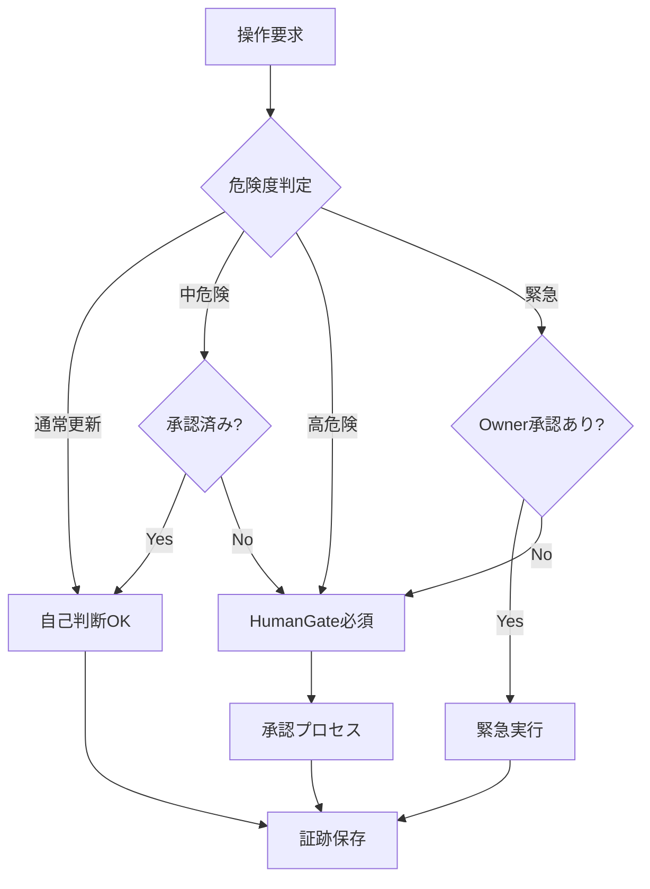
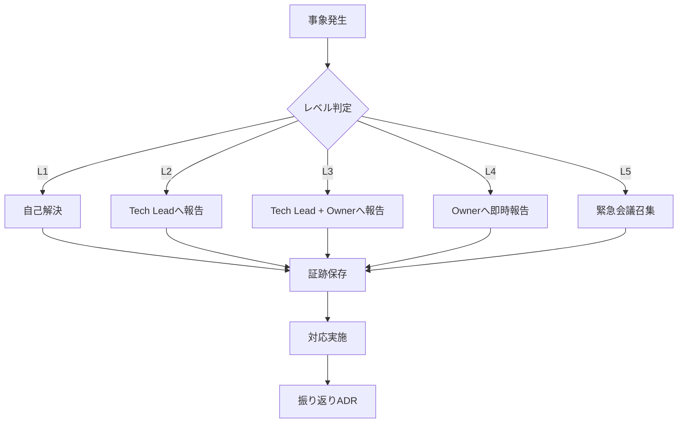

# Part 30：エージェント協調モデル（Core4連携・HITL・フォールバック）

## 0. このPartの位置づけ
- **目的**: 複数AIエージェント（Core4）の連携・Human-in-the-Loop（HITL）・フォールバックの標準モデルを定義する
- **依存**: [Part03](Part03.md)（AI Pack）、[Part21](Part21.md)（工程別AI割当）、[Part22](Part22.md)（制限耐性）、[Part00](Part00.md)
- **影響**: 全AI連携・エージェント暴走防止・制限耐性
- **Quick Start**: [手順セクション](#手順)を参照

---

## 1. 目的（Purpose）

本 Part30 は **エージェント協調モデルの標準化** を通じて、以下を保証する：

1. **役割固定**: 各AI（ChatGPT/Claude/Gemini/Z.ai）の役割を明確に分離
2. **HITL制御**: 重要決定で人間による承認を必須化
3. **フォールバック**: 制限・障害時に自動迂回
4. **暴走防止**: エージェントの無限ループ・誤操作を防止

**根拠**: rev.md「3. 工程別AI割当」「5. 代用・無料CLI」「10. 付録：フォールバックの型」

---

## 2. 適用範囲（Scope / Out of Scope）

### Scope（適用対象）
- Core4エージェント間の連携
- HITL（Human-in-the-Loop）の承認フロー
- フォールバックの自動切り替え
- エージェント暴走防止策

### Out of Scope（適用外）
- 個別AIの内部実装（各AIの仕様）
- プロンプト構造（Part26で扱う）

---

## 3. 前提（Assumptions）

1. **Core4の役割固定**がされている（Part03, Part21）
2. **LiteLLM等のルーター**が構築されている（Part22）
   - 公式ドキュメント: [LiteLLM Documentation](https://docs.litellm.ai/docs/)
   - [LiteLLM Fallbacks](https://docs.litellm.ai/docs/proxy/reliability)
   - [LiteLLM Model Fallbacks Tutorial](https://docs.litellm.ai/docs/tutorials/model_fallbacks)
3. **VibeKanban**でタスク管理されている
4. **HITL（Human-in-the-Loop）フレームワーク**が構築されている
   - [Human-in-the-Loop for AI Agents: Best Practices](https://www.permit.io/blog/human-in-the-loop-for-ai-agents-best-practices-frameworks-use-cases-and-demo)
   - [Keeping Humans in the Loop: Building Safer AI Agents](https://bytebridge.medium.com/keeping-humans-in-the-loop-building-safer-24-7-ai-agents-44a3366f94c2)
5. **MCPのLLMルーティングはvibe-mcp-flex-router-nodeで提供される**
   - MCP運用Runbookは [Part28](Part28.md) を参照

---

## 4. 用語（Glossary参照：Part02）

本Partで使用する重要用語：

- **Core4**: ChatGPT（司令塔）・Claude Code（実装）・Gemini（調査）・Z.ai（補助）の4つ
- **HITL**: Human-in-the-Loopの略。重要決定で人間による承認を必須とする仕組み
- **フォールバック**: 主担当が制限・障害時に代替AIに自動切り替えする仕組み
- **エージェント暴走**: AIが無限ループ・誤操作をする状態
- **Cline**: HITLエージェント（承認つき自動化）の実装

詳細は [glossary/GLOSSARY.md](../glossary/GLOSSARY.md) を参照。

---

## 5. ルール（MUST / MUST NOT / SHOULD）

### R-3001: Core4の役割固定【MUST】

Core4は以下の役割を固定する：

#### ChatGPT（司令塔・レビュー）
- **役割**: 最終意思決定・差分評価・DoD判定
- **使用工程**: Spec・Hard Design・Fix（論理レビュー）
- **権限**: 全AIの承認・エスカレーション判断

#### Claude Code（実装）
- **役割**: ファイル変更・コマンド実行・テスト駆動開発
- **使用工程**: Build・Fix（実装）
- **権限**: ファイル読取・変更提案（HITLで承認後に実行）

#### Gemini（調査）
- **役割**: 探索・リンク回収・一次情報収集
- **使用工程**: Research・Spec（監査）
- **権限**: Web検索・ファイル読取

#### Z.ai（補助）
- **役割**: 整形・候補列挙・軽量タスク
- **使用工程**: 雑務・コメント・ドキュメント体裁
- **権限**: 読取・軽量な生成

---

### R-3002: HITL（Human-in-the-Loop）の必須化【MUST】

以下の操作は人間による承認を必須とする：

#### 承認必須条件（Conditions）
- **ファイル変更**: Git commit・ファイル削除・大規模変更（10ファイル以上など）
- **危険コマンド**: システムへの重大な影響を伴う操作（`rm -rf`, `git push --force`等）
- **AI切り替え**: 主担当からフォールバックへの切り替え（自動通知・事後承認含む）
- **リリース**: Release Gateの通過（本番デプロイ）
- **コスト超過**: 設定された予算/トークン上限を超える操作

#### 実装方法
- **Cline**: 承認待ち状態で一時停止し、人間が`Approve/Reject`を選択
- **VS Code通知**: 承認要求を通知で表示
- **ログ**: 全承認履歴を`evidence/hitl/`に保存

---

### R-3003: フォールバックの型と切替条件【MUST】

工程別にフォールバック順と切替条件を固定する：

#### Spec/Design（長文・整合性）
1. Claude Opus（主担当）
2. Claude Sonnet
3. Gemini 3 Pro
4. （節約）Flash/GLM
5. （最終）ローカル

#### Build（差分生成・改修）
1. Codex（GPT-5.2）（主担当）
2. Claude Sonnet
3. Gemini 3 Pro
4. （節約）Flash/GLM
5. （最終）ローカル

#### 雑務（整形・命名・表）
1. Flash/GLM（主担当）
2. （必要時）Sonnet/Pro

#### 自動切り替え条件（Trigger Conditions）
- **レート制限**: APIから `429 Too Many Requests` が返却された場合
- **サービス障害**: APIから `500/503` エラーが返却された場合
- **タイムアウト**: 応答が規定時間（例: 60秒）を超えた場合
- **コンテキスト不足**: モデルの最大トークン数を超過し、圧縮も不可能な場合

---

### R-3004: エージェント暴走防止【MUST】

以下の防止策および停止・復旧手順を実装する：

#### 暴走防止策
- **VRループ3回制限**: Verify-Repairループが3回続いたらHumanGateを発動（R-1101）
- **危険コマンド禁止**: `checks/verify_repo.ps1` で危険なパターンを検出し即Failさせる
- **コンテキスト上限**: AIへの入力トークンを上限の50-80%に制限し、超過時は圧縮する

#### 停止条件と復旧手順
- **停止条件**:
  - 無限ループ検知（同一操作の10回以上の繰り返し）
  - 急激なトークン消費（1分間に規定量超過）
  - ユーザーからの明示的な停止命令（Interrupt）
- **復旧手順**:
  1. プロセスを強制終了（Kill）
  2. タスク状態を `Blocked` に変更
  3. 直前の変更をGitでロールバック（必要時）
  4. HumanGate（人間）がログを確認し、原因（プロンプト/環境）を修正して再開

---

### R-3005: エージェント間通信と最小コンテキスト【SHOULD】

エージェント間の連携とコンテキスト共有は以下のルールに従う：

#### 通信形式
- **タスクID**: VibeKanbanのチケットIDを常に共有
- **ステータス**: Spec→Research→Design→Build→Fix→Verify→Release→Operate
- **成果物**: JSON/Markdownで標準化

#### コンテキスト共有の最小ルール（衝突回避）
- **最小権限**: タスク遂行に必要なファイルのみを読み込む（`read_file`の乱用禁止）
- **衝突回避**: VibeKanbanを確認し、他エージェントが `In Progress` のファイル/領域には触れない
- **最新化**: 作業開始前に必ず `git pull` を行い、最新状態（SSOT）を確認する
- **明確なハンドオーバー**: 工程移行時は、必ず成果物（Spec/Design/Evidence）のパスを明示して次エージェントに渡す

---

## 6. 手順（実行可能な粒度、番号付き）

### 6.1 Core4役割分担表（工程×AI割当）

| 工程 | 主AI | 副AI/補完 | 入力 | 出力 | チェック | 証跡 | フォールバック |
|------|------|----------|------|------|---------|------|---------------|
| **Research** | Gemini Deep Research | Z.ai (MCP経由) | SSOT/FACTS/ADR | `research_inbox/` | Claude+ | `evidence/research/` | 人間による文献確認 |
| **Hard Design & Review** | Claude+ (Opus/Sonnet) | GPT(Projects) | Research成果 | ADR/docs/ | Gemini CLI | `evidence/design/` | 人間レビュー |
| **Implementation Bulk** | Gemini CLI / Codex | Claude+ | ADR/仕様 | 実装コード | Verify Gate | `evidence/impl/` | Claude+で再実装 |
| **Audit/整合性監査** | GPT(Projects) | Claude+ | docs/全体 | 監査レポート | 人間 | `evidence/audit/` | Claude+で再監査 |
| **Verify/Evidence** | Verify Gate(自動) | - | 変更差分 | PASS/FAIL | - | `evidence/verify_reports/` | 手動検証 |

**根拠**: [ADR-0005](../decisions/0005-vibekanban-ai-orchestration.md), [Part15](./Part15.md) R-1506

---

### 6.2 受け渡し物（ファイル/フォルダ/命名/テンプレート）

#### Research → Design 受け渡し

| 成果物 | ファイルパス | テンプレート | 命名規則 | 担当 |
|--------|-------------|-------------|----------|------|
| 研究ログ | `evidence/research/YYYYMMDD_research.md` | 要件: 調査目的・範囲・収集URL・結論 | `YYYYMMDD_<topic>_research.md` | Gemini |
| 一次情報 | `sources/research_inbox/YYYYMMDD_*/10_raw/*.md` | なし | 調査日時_名前.md | Z.ai |
| 整形済み情報 | `sources/research_inbox/YYYYMMDD_*/20_curated/*.md` | 要件: コピー元パスをメタデータとして記録 | `curated_YYYYMMDD_HHMMSS.md` | Gemini |

#### Design → Implementation 受け渡し

| 成果物 | ファイルパス | テンプレート | 命名規則 | 担当 |
|--------|-------------|-------------|----------|------|
| ADR | `decisions/000X-*.md` | [ADR_TEMPLATE](../decisions/ADR_TEMPLATE.md) | `000X-<short-desc>.md` | Claude+ |
| Spec | `docs/PartXX.md` | 各Partのテンプレート（Part00参照） | `PartXX.md` | Claude+ |
| 実装計画 | `WORK/impl/YYYYMMDD_<task-id>_plan.md` | 要件: タスクID・目標・手順・Verify観点 | `YYYYMMDD_<task-id>_plan.md` | Claude+ |

#### Implementation → Verify 受け渡し

| 成果物 | ファイルパス | テンプレート | 命名規則 | 担当 |
|--------|-------------|-------------|----------|------|
| 実装コード | 各種ファイル | - | 既存命名規則 | Gemini/Codex |
| Diff | `evidence/YYYYMMDD_HHMM_<task-id>_diff.md` | Diff Template | `YYYYMMDD_HHMM_<task-id>_diff.md` | Claude+ |
| Verifyレポート | `evidence/verify_reports/YYYYMMDD_HHMMSS_*.md` | Verify Template | `YYYYMMDD_HHMMSS_<mode>_<status>_<category>.md` | Verify Gate |

---

### 6.3 エスカレーション手順（失敗→次のAIへ）

#### レベル1: 同AI内での再試行

1. **トリガ**: Verify FAIL、API一時障害
2. **対処**: 同じAIで再実行（最大2回）
3. **証跡**: `evidence/retry/YYYYMMDD_HHMMSS_retry_<attempt>.md`

#### レベル2: フォールバックAIへ切り替え

1. **トリガ**: レベル1で解決しない、レート制限
2. **対処**: R-3003のフォールバック順に従い次AIへ切り替え
3. **証跡**: `evidence/fallback/YYYYMMDD_HHMMSS_fallback.md`
4. **切り替えログ**:
   ```json
   {
     "timestamp": "2026-01-17T12:00:00Z",
     "from": "claude-opus",
     "to": "gemini-3-pro",
     "reason": "rate_limit_429",
     "task_id": "TICKET-001"
   }
   ```

#### レベル3: 上位AIへエスカレーション

1. **トリガ**: フォールバック全て失敗、論理的な詰まり
2. **対処**: Claude Opus（上位モデル）で再検討
3. **証跡**: `evidence/escalation/YYYYMMDD_HHMMSS_escalation.md`

#### レベル4: HumanGate（人間承認）

1. **トリガ**: レベル3で解決しない、3ループ超過（Part11 R-1101）
2. **対処**: Part09 HumanGateへエスカレーション
3. **承認者判断**:
   - A) 設計変更（Spec修正）
   - B) タスク分割
   - C) 範囲縮小
   - D) SPIKE（調査専用タスク）
4. **証跡**: `evidence/humangate_escalations/YYYYMMDD_HHMMSS_HG_<task-id>.md`

---

### 6.4 HITL（Human-in-the-Loop）承認フロー

#### 承認必須操作

| 操作 | 承認タイミング | 承認者 | タイムアウト | 証跡 |
|------|---------------|--------|------------|------|
| ファイル削除 | 実行前 | 人間 | 15分 | `evidence/hitl/delete_*.md` |
| Git commit | 実行前 | 人間 | 15分 | `evidence/hitl/commit_*.md` |
| Release作成 | 実行前 | HumanGate | 24時間 | `evidence/hitl/release_*.md` |
| AI切り替え | 自動 | （自動） | 即時 | `evidence/fallback/*.md` |

#### 承認フロー

```
1. AIが承認要求を発行
   ↓
2. VS Code通知/CLIプロンプトで表示
   ↓
3. 人間が選択:
   - Approve: 処理継続
   - Reject: 修正要求
   - Skip: 手動実行
   ↓
4. 承認履歴をEvidenceに保存
   ↓
5. Approveなら処理継続、RejectならAIにフィードバック
```

---

### 手順E: HumanGate統一Runbook（承認判断・例外・緊急時・証跡）

**目的**: Part05/06/30で統一されたHumanGate運用手順を提供する

#### E-1: HumanGate判断表（承認必須/任意/不要/緊急時）

| 操作カテゴリ | 承認要件 | 通常時の承認者 | 緊急時の対応 | 証跡 | 根拠Part |
|------------|---------|--------------|------------|------|----------|
| **通常のdocs/更新** | 任意（自己責任） | 実行者自己判断 | 即時実行可 | `evidence/verify_reports/` | Part05 R-0505 |
| **sources/追加のみ** | 不要（追加は許可） | 実行者自己判断 | 即時実行可 | `evidence/sources_integrity.md` | Part05 R-0504 |
| **AIフォールバック** | 自動（システム判断） | （自動） | 自動切り替え | `evidence/fallback/*.md` | Part30 R-3003 |
| **VRループ3回** | **必須**（HumanGate発動） | Tech Lead | 即時エスカレーション | `evidence/repair_logs/VR_LOOP_*.md` | Part30 R-3004 |
| **ファイル削除** | **必須** | Maintainer以上 | 緊急時はOwner承認で即時 | `evidence/hitl/delete_*.md` | Part30 R-3002 |
| **Git commit** | **必須** | 変更者本人 | 緊急時はSkipで手動実行 | `evidence/hitl/commit_*.md` | Part30 R-3002 |
| **Git push -f** | **必須**（最高レベル） | Ownerのみ | 緊急時でも必須 | `evidence/hitl/force_push_*.md` | Part27（禁止） |
| **sources/改変検出** | **必須**（作業停止） | Tech Lead + Owner | 即時作業停止・復旧 | `evidence/sources_integrity.md` | Part05 R-0504 |
| **Release Gate通過** | **必須** | HumanGate（承認者2名） | 緊急リリースはOwner決裁 | `evidence/hitl/release_*.md` | Part30 R-3002 |
| **Verify FAIL連続3回** | **必須**（HumanGate発動） | Tech Lead | ADRで対応策決定 | `decisions/YYYYMMDD_verify_fail.md` | Part05 例外1 |
| **全フォールバック失敗** | **必須**（緊急対応） | Tech Lead + Owner | ローカルLLM or 人間手動 | `evidence/emergency_*.md` | Part30 例外1 |
| **権限逸脱検出** | **必須**（即時対処） | Tech Lead | 即時セーフレ | `evidence/role_violations.md` | Part30 9.1 |
| **エージェント暴走検出** | **必須**（緊急停止） | 実行者（即時停止） | 即座に停止・Ownerへ報告 | `evidence/infinite_loop_detected.md` | Part30 9.3 |

**判断ロジック**:


#### E-2: 緊急時の定義と手順

**緊急時の条件**:
- セキュリティ侵害が進行中
- 本番環境が停止
- データ損失が進行中
- 重大なSLA違反が発生

**緊急時の手順**:
1. **即座に**: Ownerに報告（電話/SMS）
2. **5分以内**: Owner의 承認を取得（文面でも可）
3. **実施**: 承認内容の範囲内で実行
4. **証跡**: 事後5分以内にEvidenceを補完
5. **レビュー**: 24時間以内にADRで振り返り

**緊急時の緩和策**:
- 承認タイムアウトを15分→5分に短縮
- 承認者をOwner単独に限定（通常は2名）
- 事前承認でOK（文面/チャット履歋も証跡）

#### E-3: 承認ログの最小テンプレート

**場所**: `evidence/hitl/YYYYMMDD_HHMMSS_<operation>_approval.md`

```markdown
# HumanGate 承認ログ

## 基本情報
- 承認ID: HG-YYYYMMDD-HHMMSS-<random>
- 承認日時: YYYY-MM-DD HH:MM:SS UTC
- 承認者: <name> (<role>)
- 承認結果: [APPROVED | REJECTED | DEFERRED]

## 操作内容
- 操作カテゴリ: [ファイル削除 | Git commit | Release | etc]
- 対象: <file_path/commit_hash/release_tag>
- 作業者: <name> (<role>)
- 変更概要: <summary>

## 承認判断
- 承認理由: <reason>
- リスク評価: [LOW | MEDIUM | HIGH | CRITICAL]
- 付帯条件: <conditions_if_any>

## 緊急時の場合
- 緊急区分: [true | false]
- 緊急理由: <emergency_reason>
- 事前承認者: <name> (<role>)
- 事前承認日時: YYYY-MM-DD HH:MM:SS

## 証跡
- Verifyレポート: `evidence/verify_reports/YYYYMMDD_HHMMSS_*.md`
- 変更差分: `evidence/YYYYMMDD_HHMM_<task-id>_diff.md`
- 関連ADR: `decisions/000X-*.md`

## 参照
- Part05 R-0502: 衝突裁定の記録
- Part30 R-3002: HITLの必須化
- Part30 手順E: HumanGate統一Runbook
```

#### E-4: CLI危険操作チェックリスト（実行前確認）

**適用範囲**: Part06（CLI Ops）での危険操作実行前

```markdown
□ 1. 操作の必要性確認
   □ 他の手段がないか検討したか？
   □ 本当にこの操作が必要か？

□ 2. 影響範囲の特定
   □ どのファイル/ディレクトリに影響するか？
   □ 他の作業/タスクに影響しないか？
   □ ロールバック計画はあるか？

□ 3. データ保護
   □ バックアップは取得済みか？
   □ 削除対象に重要データが含まれていないか？
   □ sources/を改変しない確認済みか？

□ 4. 承認の取得
   □ 必要な承認を得たか？（判断表E-1参照）
   □ 承認者は適切な権限を持っているか？
   □ 緊急時ならOwnerの承認を得たか？

□ 5. Verifyの準備
   □ 事前VerifyはPASSしたか？
   □ 事後Verifyの計画はあるか？
   □ 証跡保存先は決まっているか？

□ 6. 実行計画
   □ 実行コマンドを最終確認したか？
   □ ドライラン（テスト実行）したか？
   □ 実行タイミングは適切か？

□ 7. 監視と復旧
   □ 実行結果を監視する準備はあるか？
   □ 異常時の復旧手順を確認したか？
   □ 連絡先（Tech Lead/Owner）を把握しているか？

□ 8. エスカレーション
   □ 問題発生時のエスカレーション先は明確か？
   □ 証跡を渡す相手を把握しているか？（E-5参照）
```

**実行可否判断**:
- 全項目チェック済み: 実行可
- 1つでも未チェック: 実行禁止、確認が必要

#### E-5: 失敗/事故時のエスカレーション経路

**エスカレーションレベルと対応表**:

| レベル | 事象分類 | エスカレーション先 | 通知方法 | 必要な証跡 | 対応時間目安 |
|--------|---------|-----------------|---------|-----------|------------|
| **L1: 軽微** | Verify FAIL、通常のVRループ | 自己解決 | なし | `evidence/verify_reports/` | 30分以内 |
| **L2: 通常** | VRループ2回、フォールバック失敗 | Tech Lead | チャット | `evidence/fallback/*.md` | 1時間以内 |
| **L3: 重要** | VRループ3回、権限逸脱 | Tech Lead + Owner | メール+チャット | `evidence/role_violations.md`<br>`evidence/repair_logs/VR_LOOP_*.md` | 2時間以内 |
| **L4: 緊急** | sources/改変、エージェント暴走 | Owner（即時報告） | 電話/SMS | `evidence/sources_integrity.md`<br>`evidence/infinite_loop_detected.md` | 15分以内 |
| **L5: 重大** | セキュリティ侵害、データ損失 | 全ステークホルダー | 緊急会議 | `evidence/incident_*.md`<br>ADR（振り返り） | 即時対応 |

**エスカレーションパッケージ（証跡セット）**:
```markdown
## エスカレーション時に渡す証跡

1. 発生状況
   - 発生日時: YYYY-MM-DD HH:MM:SS
   - 発生場所: <Part/工程>
   - 事象分類: [L1/L2/L3/L4/L5]

2. 実行ログ
   - 実行コマンド: <command>
   - 実行ログ: `evidence/YYYYMMDD_HHMM_<task-id>_log.md`
   - エラーメッセージ: <error_message>

3. Verify結果
   - Verifyレポート: `evidence/verify_reports/YYYYMMDD_HHMMSS_*.md`
   - FAIL理由: <failure_reason>

4. 変更内容
   - 変更差分: `evidence/YYYYMMDD_HHMM_<task-id>_diff.md`
   - 影響範囲: <scope>

5. 対応状況
   - 自己対応の試み: <attempted_actions>
   - 再現手順: <reproduction_steps>

6. 参照情報
   - 関連ADR: `decisions/000X-*.md`
   - 関連タスク: <task_id>
   - 関連trace_id: <trace_id>
```

**エスカレーションフロー**:


#### E-6: HumanGateと他Partの整合性

| 項目 | Part05 | Part06 | Part30 | 統一内容 |
|------|--------|--------|--------|----------|
| **HumanGate定義** | エスカレーション先 | エスカレーション先 | HITL承認フロー | ✓ 本手順Eで統一 |
| **承認必須操作** | 未定義 | 未定義 | R-3002で定義 | ✓ E-1判断表で統一 |
| **緊急時対応** | 未定義 | 未定義 | 例外処理のみ | ✓ E-2で統一 |
| **承認ログ** | Evidenceに保存 | Evidenceに保存 | `evidence/hitl/` | ✓ E-3テンプレート統一 |
| **エスカレーション** | 例外1,3 | 例外3 | レベル4 | ✓ E-5経路図で統一 |

**参照関係の明確化**:
- Part05: Core4運用 → HumanGateが必要な場合は「Part30 手順E」を参照
- Part06: CLI Ops → 危険操作は「Part30 手順E-4チェックリスト」を参照
- Part30: HITL協調 → 本手順EがHumanGateの統一ソース（SSOT）

**用語の統一**:
- HumanGate: 人間による承認プロセス全体
- HITL: Human-in-the-Loop（技術実装）
- エスカレーション: HumanGateへの報告・承認要求行為

---

### 手順A: フォールバックの設定
1. LiteLLM設定ファイル作成: `litellm_config.yaml`
   ```yaml
   model_list:
     - model_name: "spec-primary"
       litellm_params:
         model: "claude-opus"
       fallbacks:
         - model_name: "spec-fallback-1"
           litellm_params:
             model: "claude-sonnet"
         - model_name: "spec-fallback-2"
           litellm_params:
             model: "gemini-3-pro"
   ```
2. LiteLLM起動: `litellm --config litellm_config.yaml`
3. 各AIツールがLiteLLM経由でAPI呼出

### 手順B: HITLの実行
1. AIが承認要求を発行（例：ファイル変更）
2. VS Code通知で承認要求が表示される
3. 人間が`Approve`または`Reject`を選択
4. 承認履歴をEvidenceに保存
5. `Approve`なら処理継続、`Reject`なら修正要求

### 手順C: エージェント間通信
1. ChatGPTがSpecを出力
2. VibeKanbanでステータスを`Spec`→`Design`に遷移
3. ClaudeがDesignを読取・実装
4. Verifyで品質チェック
5. 全工程のログをEvidenceに保存

### 手順D: 暴走時の対処
1. Watcher ScriptがVRループ3回を検知
2. HumanGateを発動（人間による確認を要求）
3. 必要に応じて上位AI（Opus）にエスカレーション
4. ADRで「暴走原因・対策」を記録
5. 再発防止策を実装

---

## 7. 例外処理（失敗分岐・復旧・エスカレーション）

### 例外1: 全フォールバックが失敗
**対処**:
1. ローカルLLM（Ollama）に最終フォールバック
2. 人間による手動対応
3. ADRで「全フォールバック失敗・原因・対策」を記録

---

### 例外2: HITL承認が得られない
**対処**:
1. タイムアウト（15分）で自動キャンセル
2. ステータスを`Blocked`に変更
3. VibeKanbanで担当者に通知

---

### 例外3: エージェント間通信が失敗
**対処**:
1. 通信ログを確認
2. メッセージフォーマットを検証
3. 必要に応じて手動で成果物を転送

---

## 8. 機械判定（Verify観点：判定条件・合否・ログ）

### V-3001: Core4の役割固定確認
**判定条件**: Core4の役割がR-3001に従っているか
**合否**: 違反があれば Fail
**実行方法**: `checks/verify_core4_roles.ps1`
**ログ**: `evidence/verify_reports/YYYYMMDD_HHMMSS_core4_roles.md`

---

### V-3002: フォールバック設定確認
**判定条件**: フォールバックがR-3003に従って設定されているか
**合否**: 未設定があれば警告（Fail ではない）
**実行方法**: `checks/verify_fallback.ps1`
**ログ**: `evidence/verify_reports/YYYYMMDD_HHMMSS_fallback.md`

---

### V-3003: HITL履歴確認
**判定条件**: HITL承認履歴が記録されているか
**合否**: 未記録があれば警告（Fail ではない）
**実行方法**: `checks/verify_hitl.ps1`
**ログ**: `evidence/verify_reports/YYYYMMDD_HHMMSS_hitl.md`

---

## 9. 監査観点（Evidenceに残すもの・参照パス）

### 9.1 越権防止（権限逸脱検出）

#### 検証項目
| 項目 | 検証方法 | 違反時の対処 | 証跡 |
|------|---------|-------------|------|
| **危険コマンド実行** | checks/verify_repo.ps1 で検知 | 即座にFail、手動確認要求 | `evidence/verify_reports/forbidden_patterns.md` |
| **sources/改変** | Git diffで検出 | 即座に作業停止、git checkout | `evidence/sources_integrity.md` |
| **無承認ファイル削除** | HITLログで承認確認 | 未承認なら復旧 | `evidence/hitl/delete_*.md` |
| **Role逸脱** | AI出力の役割確認 | 修正依頼 | `evidence/role_violations.md` |

#### 根拠
- [Part27 Conftest](./Part27.md) : 危険コマンド表記禁止
- [Part00 R-0003](./Part00.md) : sources/無改変
- [Part09](./Part09.md) : Permission Tier

---

### 9.2 衝突裁定（並列実行時の矛盾解消）

#### 衝突パターンと対策

| 衝突パターン | 検出方法 | 裁定ルール | 証跡 |
|-------------|---------|----------|------|
| **同ファイル同時編集** | Git worktree分離 | 先にマージした方を優先、後者はRebase | `evidence/merge_conflicts.md` |
| **Spec矛盾** | Part10 Verifyで検出 | ADRで決定、古いSpecを破棄 | `decisions/000X-spec-conflict.md` |
| **Evidence重複** | タイムスタンプ比較 | 最新の証跡を採用 | `evidence/evidence_duplicates.md` |
| **タスク依存逆転** | VibeKanbanで検出 | 依存順序を修正 | `evidence/dependency_fixes.md` |

#### 並列実行制限
- Sタスク: 最大2並列（別worktree）
- Mタスク: 1並列（単独実行）
- Lタスク: 0並列（他タスク停止）

根拠: [Part15 R-1506](./Part15.md)

---

### 9.3 暴走停止条件（エージェン対策）

#### 停止トリガー

| トリガー | 条件 | 対処 | 証跡 |
|---------|------|------|------|
| **VRループ3回** | 同一VerifyIDが3回FAIL | HumanGateエスカレーション | `evidence/repair_logs/VR_LOOP_*.md` |
| **無限ループ検出** | 同一操作が10回以上繰り返し | 即座に停止、人間介入 | `evidence/infinite_loop_detected.md` |
| **異常終了連続** | プロセスクラッシュが3回連続 | フォールバック先変更 | `evidence/crash_logs.md` |
| **コンテキスト超過** | 入力が上限の80%超 | コンテキスト圧縮 | `evidence/context_overflow.md` |

#### 緊急停止手順
1. Watcher Scriptが異常検知
2. 該当AIプロセスを強制終了（`pkill`）
3. 状態を`Blocked`に変更（VibeKanban）
4. 緊急停止ログをEvidenceに保存
5. 人間が原因調査・対処

根拠: [Part11 R-1101](./Part11.md), [Part29](./Part29.md)

---

### 9.4 再現性保証（Evidence完全性）

#### 必須証跡セット

| 工程 | 必須証跡 | 保存先 | 形式 |
|------|---------|--------|------|
| **Research** | 研究ログ・一次情報URL | `evidence/research/` | Markdown |
| **Design** | ADR・Spec | `decisions/`, `docs/` | Markdown |
| **Implementation** | Diff・コミットログ | `evidence/`, Git Log | Markdown |
| **Verify** | 証跡4点セット | `evidence/verify_reports/` | Markdown |
| **Release** | manifest/sha256/SBOM | `RELEASE_*/` | JSON/Text |

#### 再現性チェックリスト
- [ ] 全工程のEvidenceが存在する
- [ ] 証跡4点（link_check/parts_integrity/forbidden_patterns/sources_integrity）が揃っている
- [ ] タイムスタンプが正確（UTC推奨）
- [ ] 参照パスが有効（リンク切れなし）
- [ ] 人間承認のログがある（HITL実施時）

根拠: [Part12 Evidence](./Part12.md), [Part13 Release](./Part13.md)

---

### E-3001: HITL承認履歴
**保存内容**: タスクID・承認内容・承認者・承認日時
**参照パス**: `evidence/hitl/YYYYMMDD_hitl.md`
**保存場所**: `evidence/hitl/`

---

### E-3002: フォールバックログ
**保存内容**: 元モデル・フォールバック先・原因・日時
**参照パス**: `evidence/fallback/YYYYMMDD_fallback.md`
**保存場所**: `evidence/fallback/`

---

### E-3003: エージェント間通信ログ
**保存内容**: 送信元・送信先・メッセージ内容・日時
**参照パス**: `evidence/agent_comm/YYYYMMDD_agent_comm.md`
**保存場所**: `evidence/agent_comm/`

---

## 10. チェックリスト

- [x] 本Part30 が全12セクション（0〜12）を満たしているか
- [x] Core4の役割固定（R-3001）が明記されているか
- [x] HITLの必須化（R-3002）が明記されているか
- [x] フォールバックの型（R-3003）が明記されているか
- [x] エージェント暴走防止（R-3004）が明記されているか
- [x] エージェント間通信（R-3005）が明記されているか
- [x] 各ルールに rev.md への参照が付いているか
- [x] Verify観点（V-3001〜V-3003）が機械判定可能な形で記述されているか
- [x] Evidence観点（E-3001〜E-3003）が参照パス付きで記述されているか
- [ ] 本Part30 を読んだ人が「エージェント協調モデル」を理解できるか

---

## 11. 未決事項（推測禁止）

### U-3001: フォールバックのタイムアウト
**問題**: フォールバックのタイムアウト時間が未定。
**影響Part**: Part30（本Part）
**暫定対応**: 各フォールバックで30秒、最終で5分。

---

### U-3002: HITLの承認権限
**問題**: 誰がHITLを承認できるか未定。
**影響Part**: Part30（本Part）、Part09（Permission Tier）
**暫定対応**: Part09 Permission Tierに従い、Owner/Maintainerのみ承認可能。

---

### U-3003: エージェント間通信のプロトコル
**問題**: 標準プロトコル（MCP等）を使用するか未定。
**影響Part**: Part30（本Part）、Part28（MCP連携）
**暫定対応**: MCPベースのプロトコルを使用。

---

## 12. 参照（パス）

### docs/
- [docs/Part00.md](Part00.md) : SSOT憲法
- [docs/Part03.md](Part03.md) : AI Pack（Core4）
- [docs/Part09.md](Part09.md) : Permission Tier
- [docs/Part11.md](Part11.md) : VRルール
- [docs/Part21.md](Part21.md) : 工程別AI割当
- [docs/Part22.md](Part22.md) : 制限耐性設計
- [docs/Part28.md](Part28.md) : MCP連携設計

### HITL（Human-in-the-Loop）一次情報
- [Human-in-the-Loop for AI Agents: Best Practices](https://www.permit.io/blog/human-in-the-loop-for-ai-agents-best-practices-frameworks-use-cases-and-demo) : HITLベストプラクティス（2025年6月）
- [Keeping Humans in the Loop: Building Safer AI Agents](https://bytebridge.medium.com/keeping-humans-in-the-loop-building-safer-24-7-ai-agents-44a3366f94c2) : HITLによる24/7 AIエージェントの安全な構築
- [Human-in-the-Loop AI in 2025: Proven Design Patterns](https://blog.ideafloats.com/human-in-the-loop-ai-in-2025/) : 2025年のHITL AI設計パターン
- [Safety & Guardrails for Agentic AI Systems (2025)](https://skywork.ai/blog/agentic-ai-safety-best-practices-2025-enterprise/) : エージェンティブAIシステムの安全性とガードレール

### フォールバック（LiteLLM）一次情報
- [LiteLLM Documentation](https://docs.litellm.ai/docs/) : LiteLLM公式ドキュメント
- [LiteLLM Fallbacks - Proxy Reliability](https://docs.litellm.ai/docs/proxy/reliability) : フォールバック設定
- [LiteLLM Routing, Loadbalancing & Fallbacks](https://docs.litellm.ai/docs/routing-load-balancing) : ルーティング・ロードバランシング
- [Model Fallbacks w/ LiteLLM](https://docs.litellm.ai/docs/tutorials/model_fallbacks) : モデルフォールバックチュートリアル

### sources/
- [_imports/最終調査_20260115_020600/_kb/2026_01_版：最高精度_大規模_制限耐性_統合案_最終改善（rev.md](../_imports/最終調査_20260115_020600/_kb/2026_01_版：最高精度_大規模_制限耐性_統合案_最終改善（rev.md) : 原文（工程別AI割当・フォールバックの型）

### glossary/
- [glossary/GLOSSARY.md](../glossary/GLOSSARY.md) : 用語の唯一定義

### checks/
- `checks/verify_core4_roles.ps1` : Core4役割確認（未作成）
- `checks/verify_fallback.ps1` : フォールバック設定確認（未作成）
- `checks/verify_hitl.ps1` : HITL履歴確認（未作成）

### evidence/
- `evidence/hitl/` : HITL承認履歴
- `evidence/fallback/` : フォールバックログ
- `evidence/agent_comm/` : エージェント間通信ログ

### その他
- [CLAUDE.md](../CLAUDE.md) : Claude Code 常設ルール
